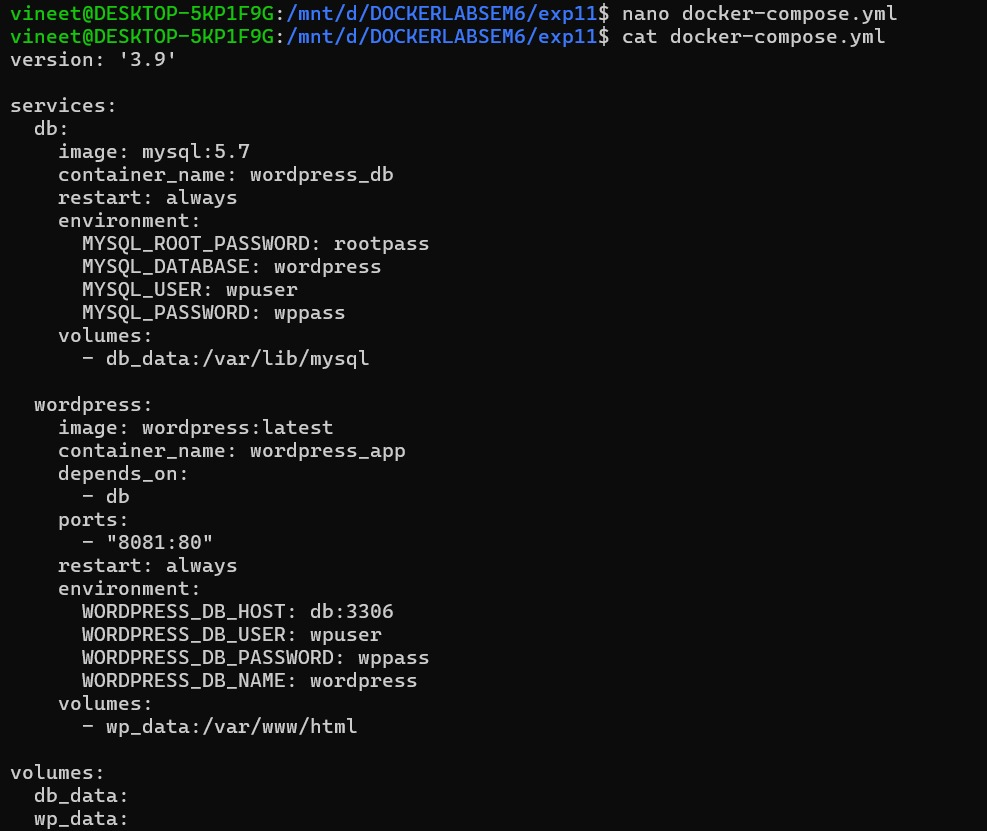
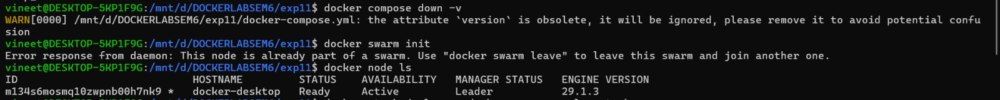
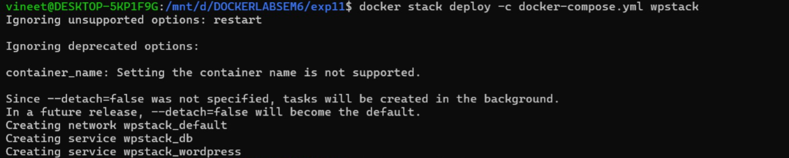
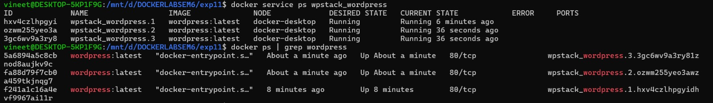
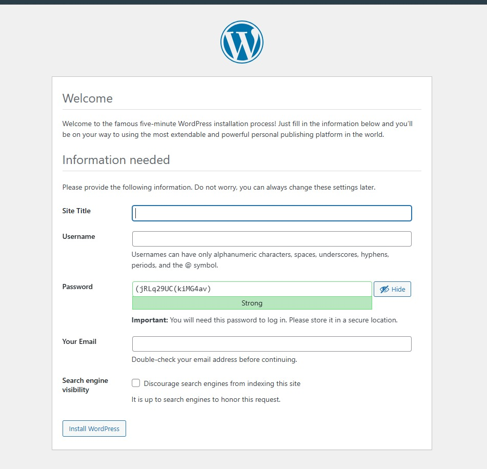
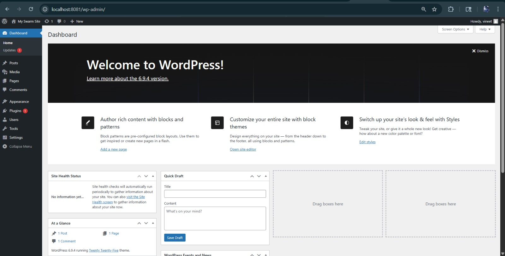
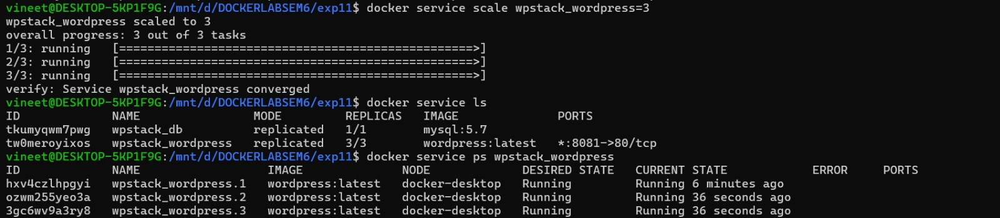
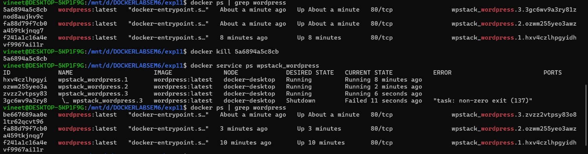
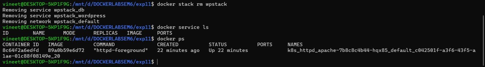

# Experiment 11: Orchestration using Docker Compose & Docker Swarm

---

## Objective
To extend Docker Compose (Experiment 6) with Docker Swarm orchestration — enabling scaling, self-healing, and load balancing for a WordPress + MySQL application.

---

## Theory

**Docker Compose** runs multiple containers on a single host but has no auto-recovery or scaling. **Docker Swarm** adds orchestration on top — managing containers automatically across one or more machines.

| Feature | Docker Compose | Docker Swarm |
|---|---|---|
| Scaling | Manual | One command |
| Self-healing | No | Yes (automatic) |
| Load balancing | No | Yes (built-in) |
| Multi-host | No | Yes |

**Progression path:**
```
docker run → Docker Compose → Docker Swarm → Kubernetes
```

---

## Prerequisites
- Docker installed and running
- `docker-compose.yml` from Experiment 6 (WordPress + MySQL)

### docker-compose.yml
```yaml
services:
  db:
    image: mysql:5.7
    environment:
      MYSQL_ROOT_PASSWORD: rootpass
      MYSQL_DATABASE: wordpress
      MYSQL_USER: wpuser
      MYSQL_PASSWORD: wppass
    volumes:
      - db_data:/var/lib/mysql

  wordpress:
    image: wordpress:latest
    depends_on:
      - db
    ports:
      - "8081:80"
    environment:
      WORDPRESS_DB_HOST: db:3306
      WORDPRESS_DB_USER: wpuser
      WORDPRESS_DB_PASSWORD: wppass
      WORDPRESS_DB_NAME: wordpress
    volumes:
      - wp_data:/var/www/html

volumes:
  db_data:
  wp_data:
```


---

## Practical

### Task 1 and Task 2 — Clean up previous containers & Initialize Docker Swarm
```bash
docker compose down -v
```
Expected: empty container list.

```bash
docker swarm init
```
If already initialized:
```bash
docker node ls
```
Expected output:
```
ID                            HOSTNAME         STATUS    AVAILABILITY   MANAGER STATUS
m134s6mosmq10zwpnb00h7nk9 *   docker-desktop   Ready     Active         Leader
```


---

### Task 3 — Deploy as a Stack
```bash
docker stack deploy -c docker-compose.yml wpstack
```
Output:
```
Creating network wpstack_default
Creating service wpstack_db
Creating service wpstack_wordpress
```
> In Swarm, we deploy **stacks** (groups of services) instead of individual containers.



---

### Task 4 — Verify the Deployment
```bash
docker service ls
```
```
ID             NAME                MODE         REPLICAS   IMAGE
tkumyqwm7pwg   wpstack_db          replicated   1/1        mysql:5.7
tw0meroyixos   wpstack_wordpress   replicated   1/1        wordpress:latest   *:8081->80/tcp
```


```bash
docker service ps wpstack_wordpress
docker ps
```
Containers are now named `wpstack_wordpress.1.xxxxx` — managed by Swarm, not by you directly.



---

### Task 5 — Access WordPress
Open browser at: **http://localhost:8081**

Fill in the WordPress setup form and install. The application works identically even though Swarm is now managing it behind the scenes.






---

### Task 6 — Scale the Application
```bash
docker service scale wpstack_wordpress=3
```
Verify:
```bash
docker service ls
```
```
NAME                MODE         REPLICAS
wpstack_db          replicated   1/1
wpstack_wordpress   replicated   3/3
```
```bash
docker service ps wpstack_wordpress
```
```
wpstack_wordpress.1   Running   8 minutes ago
wpstack_wordpress.2   Running   36 seconds ago
wpstack_wordpress.3   Running   36 seconds ago
```
All 3 containers share port 8081 through Swarm's **internal load balancer** — no port conflicts.



---

### Task 7 — Test Self-Healing
```bash
# Find a container ID
docker ps | grep wordpress

# Kill one container
docker kill <container-id>

# Watch Swarm recover
docker service ps wpstack_wordpress
```
Output observed:
```
wpstack_wordpress.3      Running    6 seconds ago       ← NEW (auto-created)
 \_ wpstack_wordpress.3  Shutdown   Failed 11 sec ago   ← KILLED (exit 137)
```
Swarm detected the failure and launched a replacement automatically. Total replicas stayed at **3/3**.



---

### Task 8 — Remove the Stack
```bash
docker stack rm wpstack
```
```
Removing service wpstack_db
Removing service wpstack_wordpress
Removing network wpstack_default
```
Verify cleanup:
```bash
docker service ls   # empty
docker ps           # no containers
```
> Volumes persist unless removed with `docker volume prune`.



---

## Key Observations

1. **Same Compose file works for both** — `docker compose up` (single host) and `docker stack deploy` (Swarm). Swarm extends Compose, it doesn't replace it.

2. **Services vs Containers** — In Swarm you manage services. Swarm manages the individual containers for you.

3. **Port conflict solved** — Plain Compose can't scale past 1 replica on a fixed port. Swarm's load balancer listens on the port once and distributes traffic internally.

---

## Quick Reference

```bash
docker swarm init                                          # enable Swarm
docker stack deploy -c docker-compose.yml <stack-name>    # deploy stack
docker service ls                                         # list services
docker service scale <stack_service>=<count>              # scale
docker service ps <service-name>                          # inspect tasks
docker stack rm <stack-name>                              # remove stack
docker swarm leave --force                                # exit Swarm
```

---

## Conclusion

This experiment demonstrated how Docker Swarm transforms a basic Compose setup into a production-ready orchestrated deployment. Using the same `docker-compose.yml` from Experiment 6, we deployed a WordPress + MySQL stack to Swarm, scaled it to 3 replicas with a single command, and observed Swarm automatically recovering a killed container within seconds. The key takeaway is simple — **Compose defines the application, Swarm runs it reliably.**
