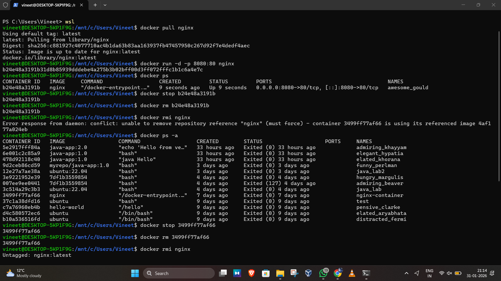
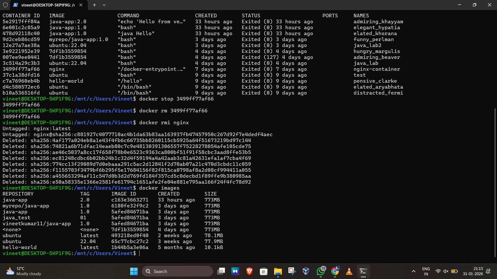

# Experiment 2  
## Docker Installation, Configuration, and Running Images

---

## Objective
- Pull Docker images  
- Run containers  
- Manage container lifecycle  

---
## STEPS ARE AS FOLLOWS:
 - Pulled Nginx Image from Docker Hub
 - Ran Nginx Container with Port Mapping
 - Verified Running Containers
 - Stopped and Removed Running Container
 - Removed Nginx Image from System
   

## Result
Docker images were successfully pulled, containers executed, and lifecycle operations were performed.

---

## Overall Conclusion
This experiment demonstrated basic Docker image handling and container lifecycle management, including pulling images, running containers, verifying status, stopping containers, and removing images.

