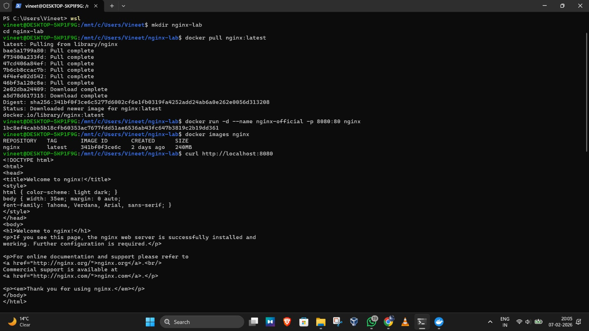
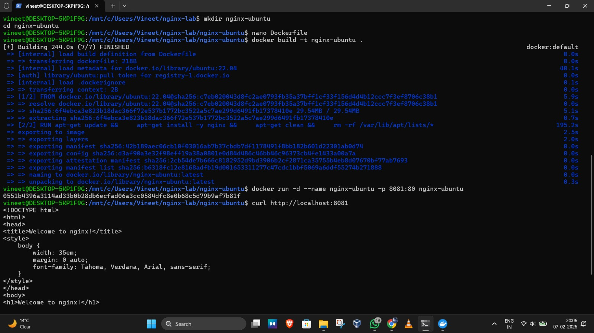
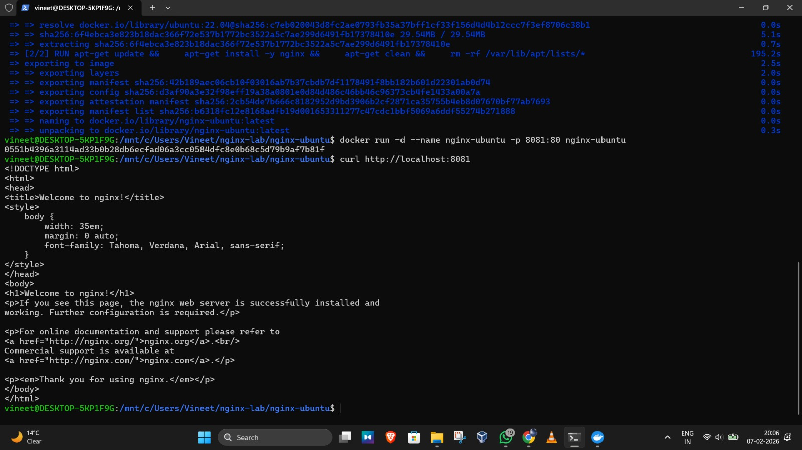
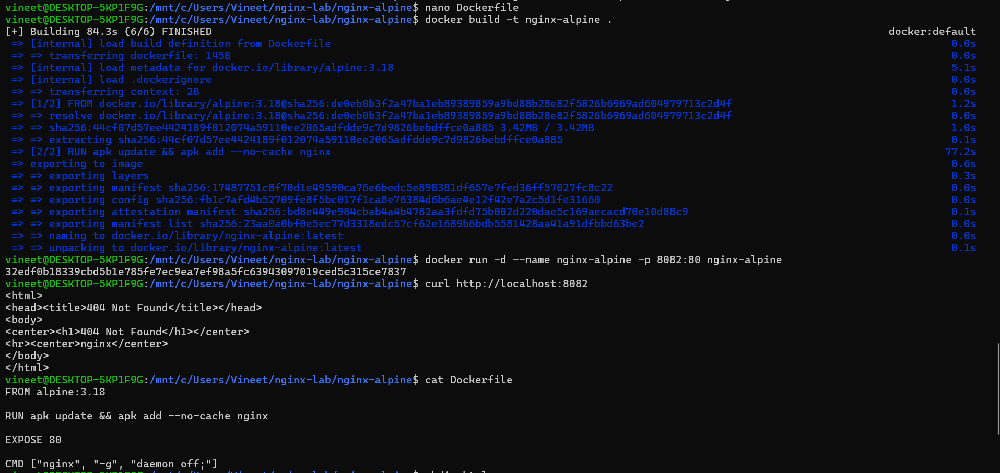
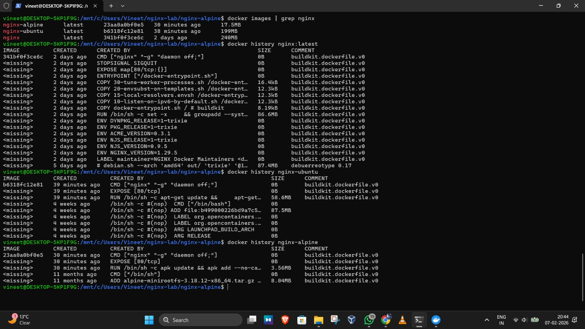
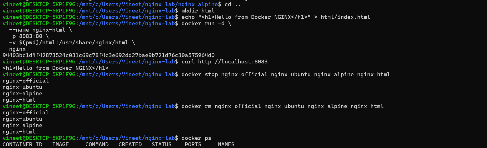

# Experiment: NGINX Deployment Using Different Base Images

## Objective
Deploy NGINX using different Docker base images and compare image size, layers, and usage.

## Part 1: Official NGINX Image
```
docker pull nginx:latest
docker run -d --name nginx-official -p 8080:80 nginx
curl http://localhost:8080
```



## Part 2: Ubuntu base Image

Dockerfile :
```
FROM ubuntu:22.04
   RUN apt-get update && \
      apt-get install -y nginx && \
      apt-get clean && \
      rm -rf /var/lib/apt/lists/*

  EXPOSE 80
  CMD ["nginx", "-g", "daemon off;"]
```




## Part 3: Alpine Base Image

Dockerfile :
```
FROM alpine:3.18

RUN apk update && apk add --no-cache nginx

EXPOSE 80
CMD ["nginx", "-g", "daemon off;"]
```


Using custom HTML :


## Part 4: Image Size and layer Comparison


## Part 5: Using HTML and then cleanup

