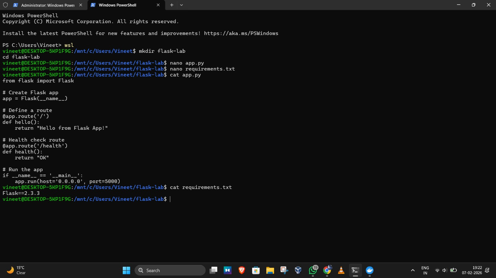
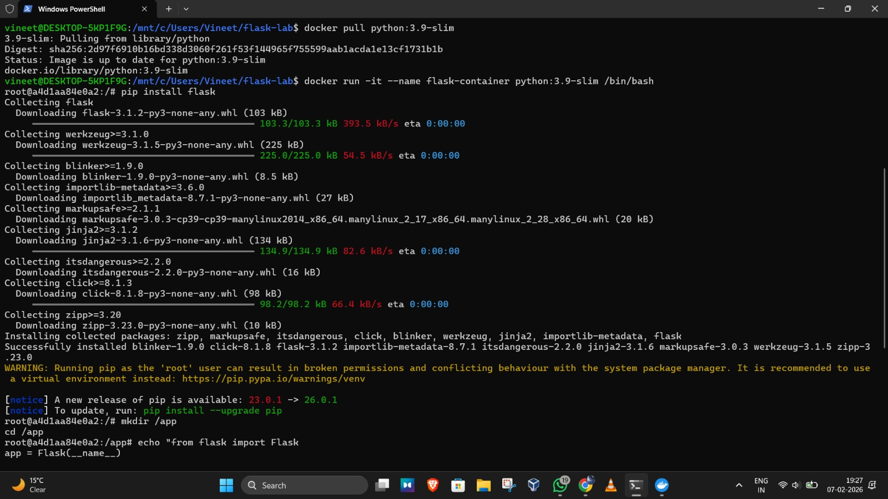
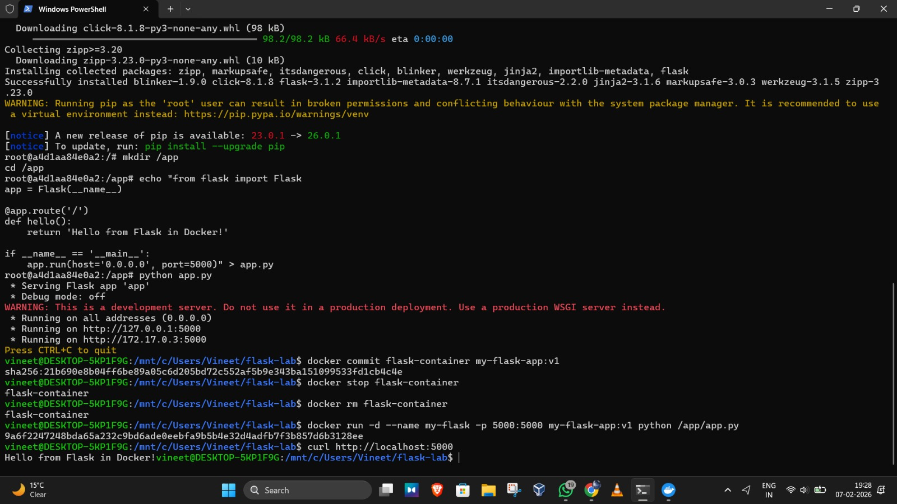
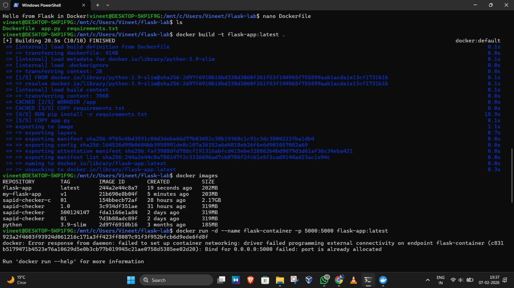
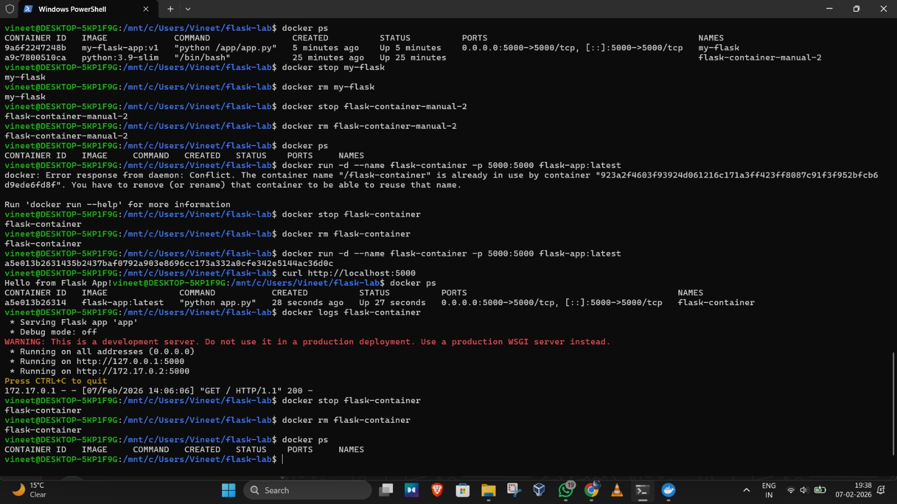

# Experiment 4: Dockerfile for Web App Containerization

## Part 1: Flask Application

### Lab 1: Basic Flask Web App Structure

- Created a Flask project directory (`flask-lab`)
- Added `app.py` with basic routes:
  - `/` → returns **Hello from Flask App!**
  - `/health` → returns **OK**
- Added `requirements.txt` with Flask dependency
- Verified application code structure (without running locally due to system package restrictions)

  

### Lab 2: Run Flask App with Docker (Manual Method)

- Pulled official Python base image (`python:3.9-slim`)
- Started an interactive container using the Python image
- Installed Flask **inside the container**
- Created `/app` directory inside the container
- Manually created `app.py` inside the container
- Ran Flask app inside the container
- Detached from the running container
- Saved the container as an image using `docker commit`
- Ran a new container from the committed image
- Verified application output using browser and `curl`

  
  

**Result:**  
Flask application successfully ran from a manually created Docker image.

## Lab 3: Flask App with Dockerfile (Automated Method)

- Created a Dockerfile to automate container setup
- Used `python:3.9-slim` as base image
- Set working directory inside container
- Installed dependencies using `requirements.txt`
- Copied application source code
- Exposed port `5000`
- Built Docker image using Dockerfile
- Ran container from the built image
- Verified application using `curl` and browser
- Viewed container logs and managed container lifecycle

**Result:**  
Flask application successfully containerized using Dockerfile.

### Comparison: Manual vs Dockerfile Approach

**Manual Method**
- Helpful for understanding Docker internals
- Time-consuming and not repeatable

**Dockerfile Method**
- Fully automated and repeatable
- Recommended for real-world projects
- Easy to version control and share
  
### Key Takeaways
- Docker containers package application and dependencies together
- Dockerfile automates manual container steps
- Port mapping is required to access container services
- Dockerfile-based workflow is best for production and collaboration

---
## Part 2 :
