# Experiment-5: Docker - Volumes, Environment Variables, Monitoring & Networks

## PART 1 – DOCKER VOLUMES
### LAB 1 – Data is Ephemeral
- Created container.
- Inside it created a text file.
- After restarting container test file remains.
- But after removing the container text file also gone.
  
 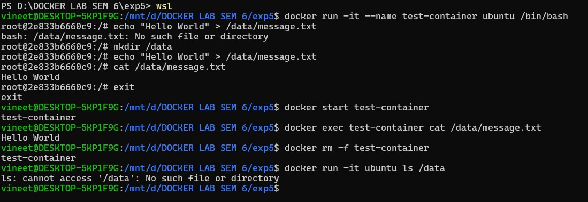

### LAB 2 – Volume Types

#### 1.Anonymous Volume
- You’ll see random hash name,Why?
- Because:
  - No volume name provided
  - Docker auto-created volume
    
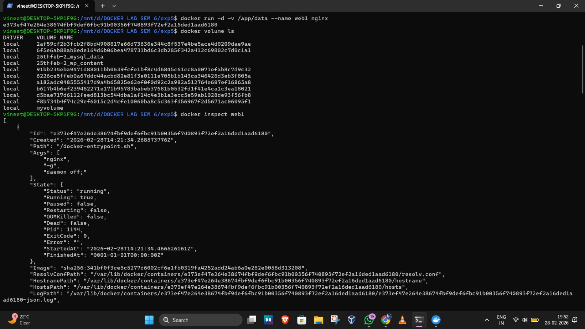
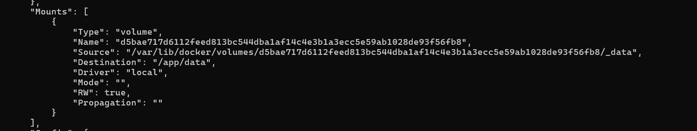

#### 2.Named Volume
- What Happens?
- Docker maps: ``` mydata → /var/lib/docker/volumes/mydata ```

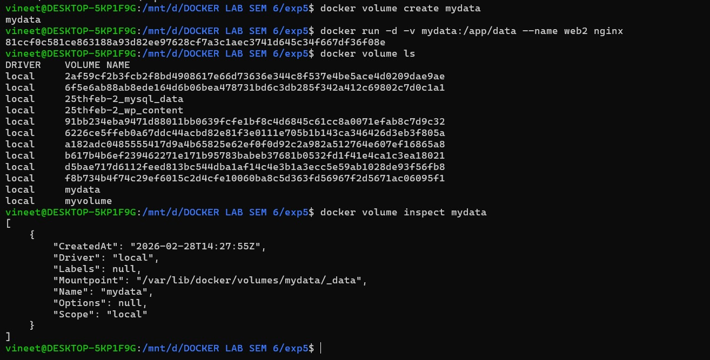

#### 3.Bind Mount
- bind mount links: Host folder ↔ Container folder

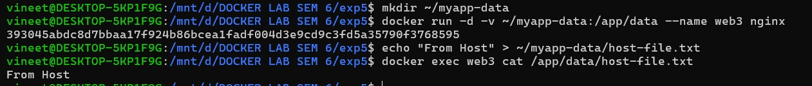

### LAB 3 – Database with Volume
- Ran mysql
- Stopped and Removed it
- Ran again
- Why Data Still Exists?
- Because: Database files are stored in volume, not in container.


-EXAMPLE 2 : WITH CONFIGURATION FILES:
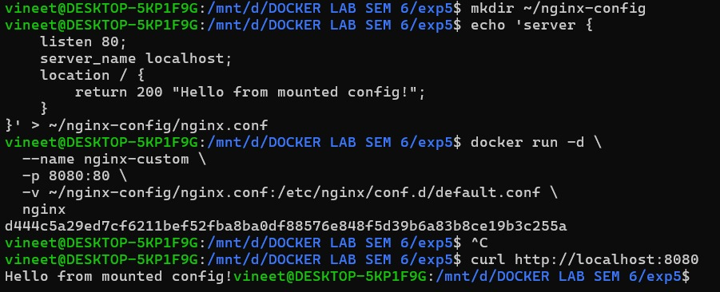


## PART 2 – ENVIRONMENT VARIABLES

### LAB - 1 :Setting env variables
### Method 1 –> -e flag


### Method 2 –> --env-file
-Create env file:


-use env file:


-use multiple env file:
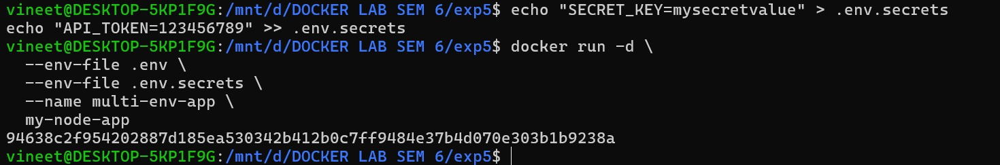

- Environment variables allow:
  - Configuration without changing image
  - 12-factor app principle
    
### LAB - 2 : Environment Variables in Applications
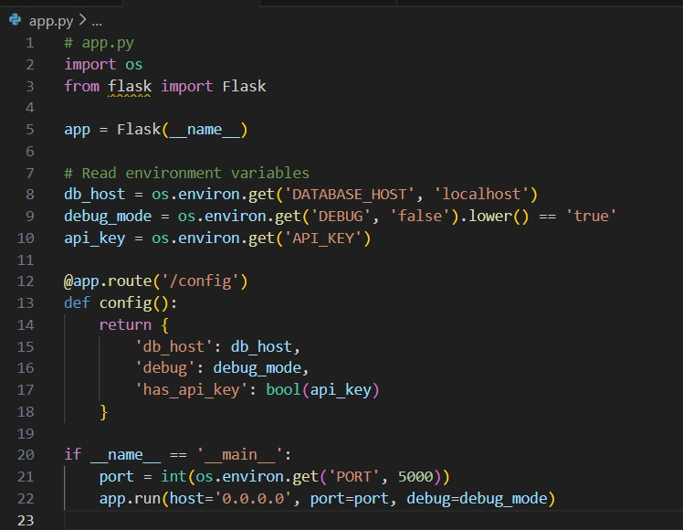
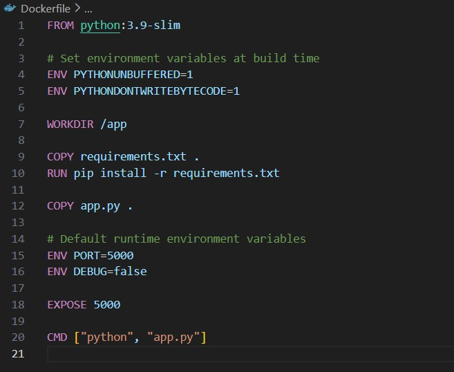

### LAB - 3 : TEST Environment Variables
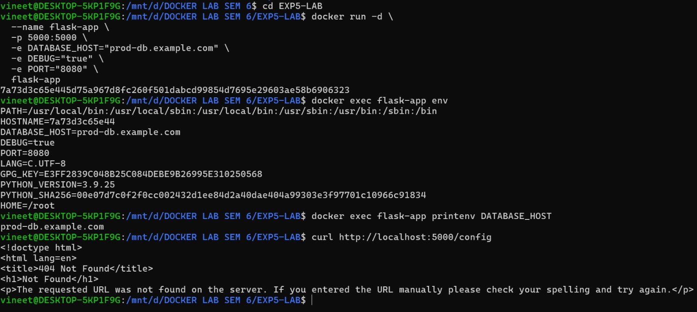


## PART 3 – MONITORING

#### 1. 
``` Docker stats ```
- Shows:
  - CPU %
  - Memory usage
  - Network IO
  - Block IO

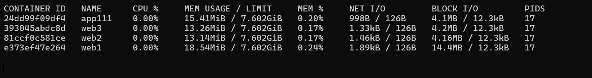

``` docker stats container1 container2```
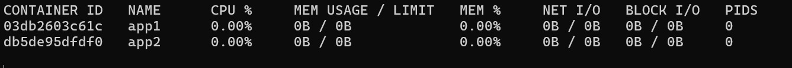

``` docker stats --no-stream```
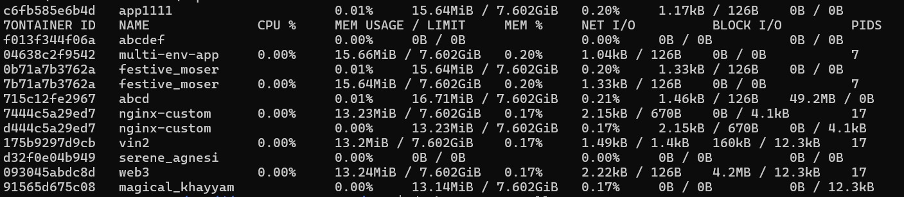

``` docker stats --all```
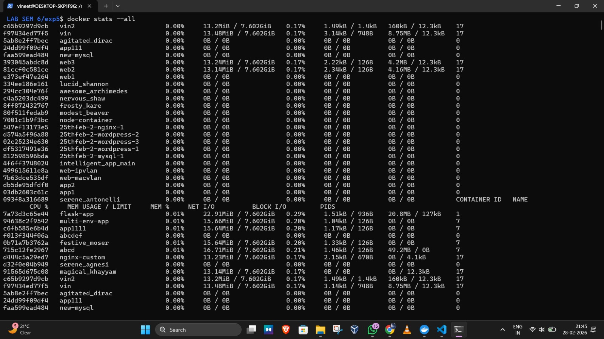

#### 2. 
``` docker top container-name ```
- Shows running processes inside container.

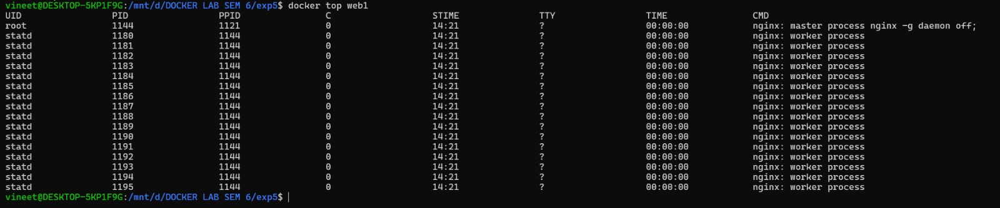

#### 3.
```docker logs container-name```
```docker logs -f container-name```
    
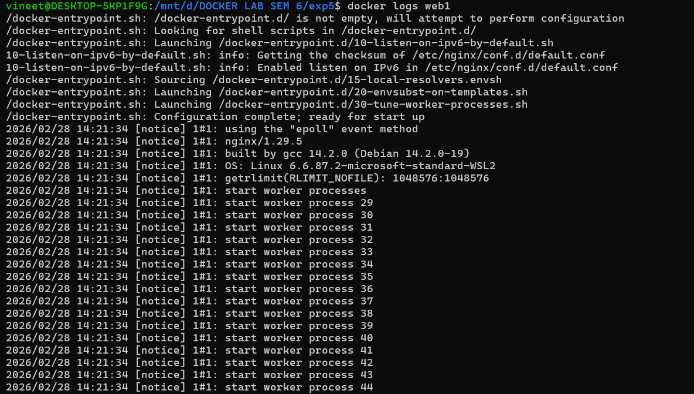

#### 4.
```docker inspect container-name```

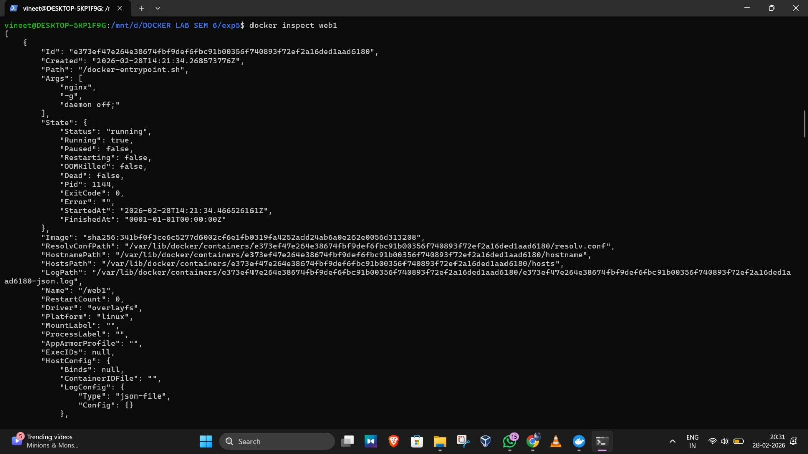
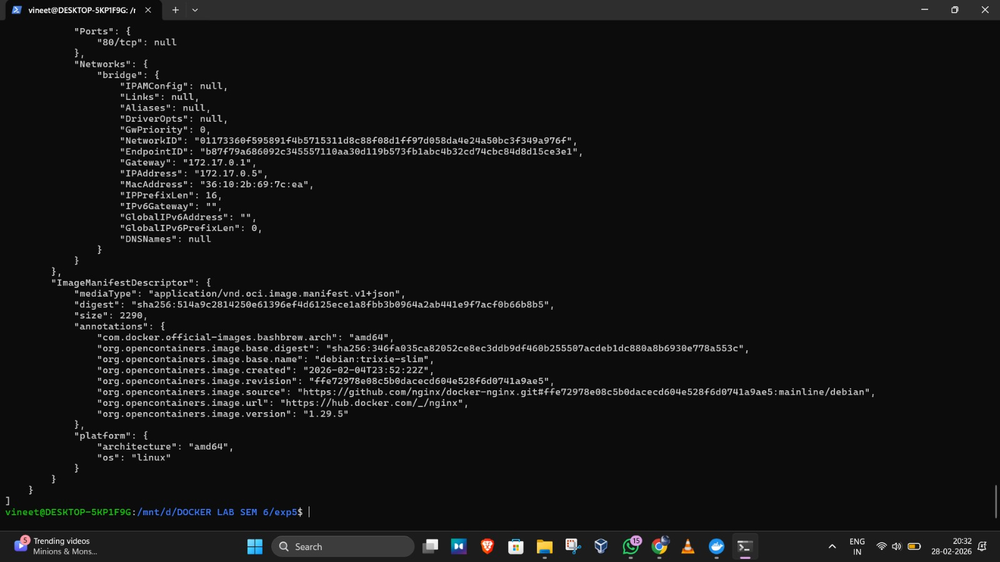

## PART 4 – NETWORKS
#### 1.
```docker network ls```
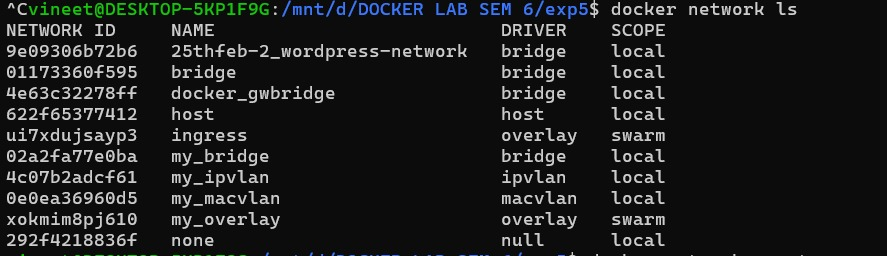

#### Custom Bridge Network :
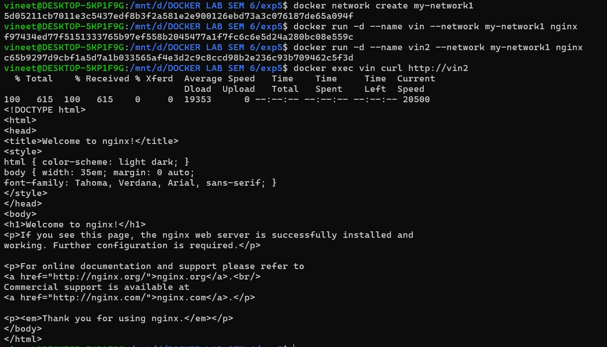

#### Host Network:


#### None Network:


#### overlay Network:


#### Multi container application example
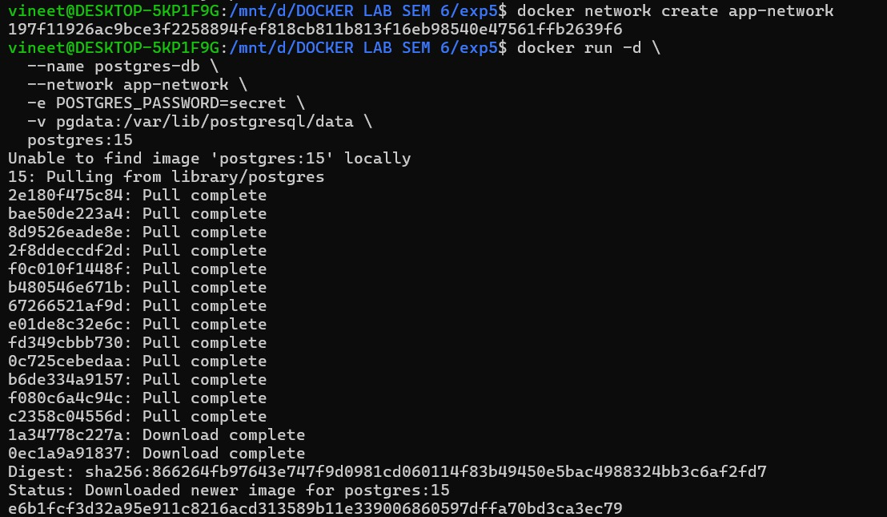
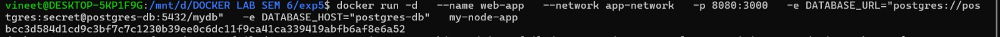

#### Newtork inspection and debugging
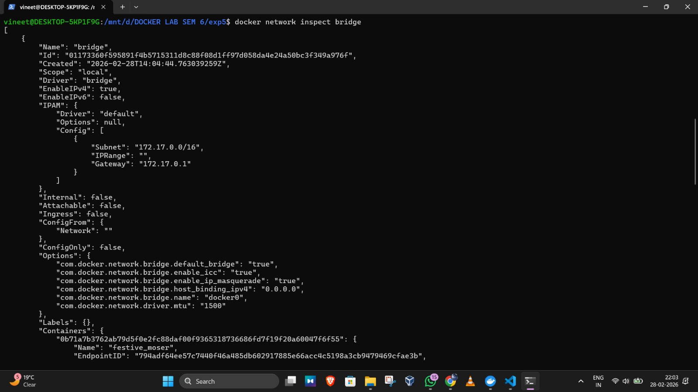

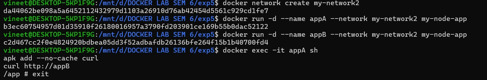

#### Port Mapping
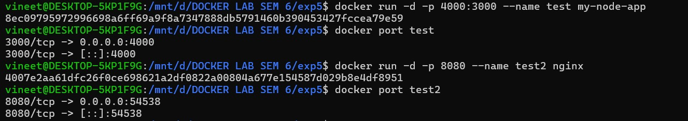
