# Experiment 6 : Comparison of Docker Run and Docker Compose

## PART A – THEORY

### Docker Run vs Docker Compose – Theory Summary

#### 1. Objective

The objective of this experiment is to understand the relationship between docker run and Docker Compose, and to compare their configuration style, syntax, and practical use cases in containerized environments.

---

#### 2. Background Theory

#### 2.1 Docker Run – Imperative Approach

The docker run command is used to create and start a container directly from an image. It follows an imperative approach, which means the user provides step-by-step instructions every time a container is created.

When using docker run, we manually specify configuration options such as:

- Port mapping (-p)
- Volume mounting (-v)
- Environment variables (-e)
- Network configuration (--network)
- Restart policies (--restart)
- Resource limits (--memory, --cpus)
- Container name (--name)
- Detached mode (-d)

Example:

docker run -d \
  --name my-nginx \
  -p 8080:80 \
  -v ./html:/usr/share/nginx/html \
  -e NGINX_HOST=localhost \
  --restart unless-stopped \
  nginx:alpine

In this approach, every time the container is recreated, the full command must be rewritten. It is suitable for quick testing, single-container applications, and learning purposes, but becomes difficult to manage as application complexity increases.

---

#### 2.2 Docker Compose – Declarative Approach

Docker Compose uses a YAML configuration file (docker-compose.yml) to define services, networks, volumes, and environment variables in a structured and organized format.

It follows a declarative approach, meaning the user defines the desired final state of the application instead of providing step-by-step instructions.

Instead of running multiple docker run commands, a single command is used:

docker compose up -d

Docker Compose reads the configuration file and automatically creates and manages containers based on that definition.

Equivalent Compose configuration:

version: '3.8'

services:
  nginx:
    image: nginx:alpine
    container_name: my-nginx
    ports:
      - "8080:80"
    volumes:
      - ./html:/usr/share/nginx/html
    environment:
      NGINX_HOST: localhost
    restart: unless-stopped

Docker Compose allows configuration to be saved in a file, reused easily, version-controlled, and shared across teams. It is especially useful for multi-container applications.

---

#### 3. Mapping: Docker Run vs Docker Compose

Docker Run Flag → Docker Compose Equivalent

-p 8080:80 → ports:
-v host:container → volumes:
-e KEY=value → environment:
--name → container_name:
--network → networks:
--restart → restart:
--memory → deploy.resources.limits.memory
--cpus → deploy.resources.limits.cpus
-d → docker compose up -d

This mapping shows that Docker Compose provides a structured and cleaner alternative to complex docker run commands.

---

#### 4. Advantages of Docker Compose

Docker Compose provides several advantages:

- Simplifies multi-container application management
- Ensures reproducibility across environments
- Allows configuration to be version-controlled
- Provides unified lifecycle management (up, down, restart)
- Supports service scaling

Example of scaling:

docker compose up --scale web=3

This command runs three instances of the web service without manually executing multiple docker run commands.

---

#### 5. Conclusion

Docker run is best suited for quick testing and single-container setups where manual control is required.

Docker Compose is ideal for structured, scalable, and production-ready applications involving multiple services.

In simple terms:

Docker Run = Imperative, manual, step-by-step approach  
Docker Compose = Declarative, structured, reusable, and scalable approach  

Understanding both approaches helps in selecting the right tool depending on application complexity and deployment requirements.


## Part - B : PRACTICLE:

### Task 1: Single Container Comparison
#### A : Run Nginx Using Docker Run
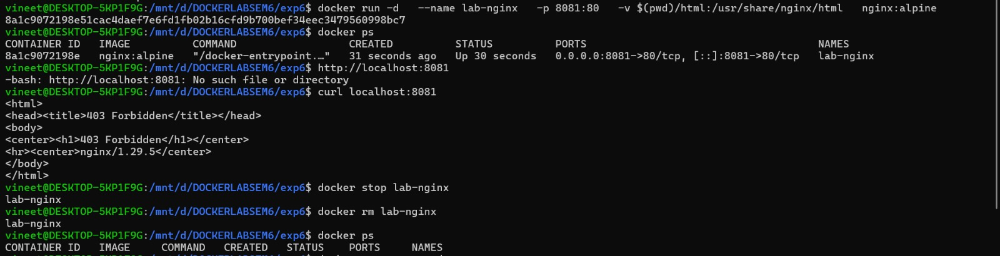
 
#### B : Run Same Setup Using Docker Compose
- yml file:
  
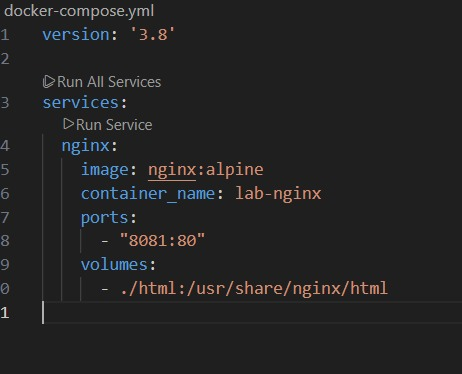

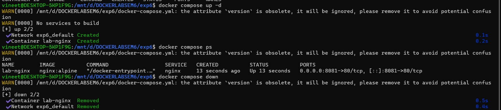


### Task 2: Multi-Container Application
- Objective:
- Deploy WordPress with MySQL using:
   - Docker Run (manual way)
   - Docker Compose (structured way)
#### A : Using Docker Run
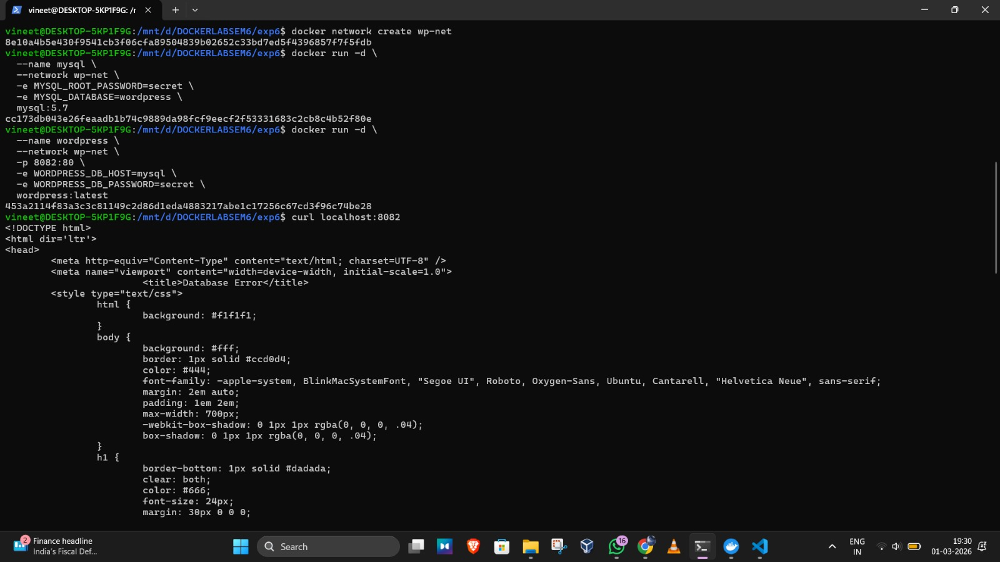
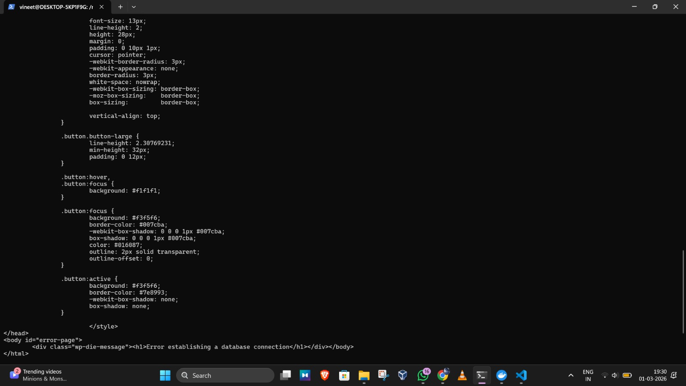

#### B : Using Docker Compose
-yml file:

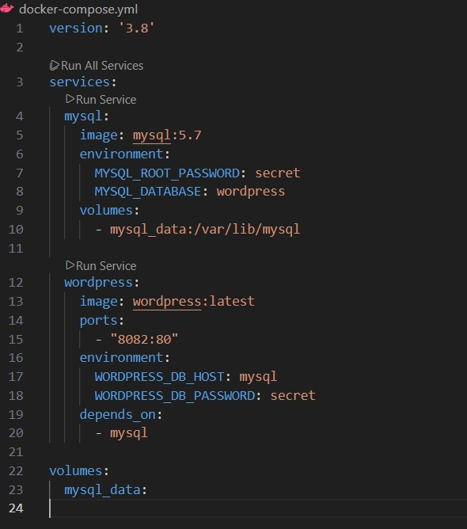

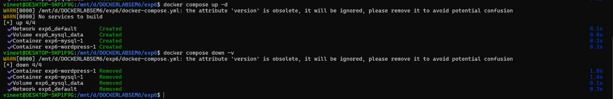

## PART - C :

### Task 3: Convert Docker Run to Docker Compose

### Problem 1: Basic Web Application
- Given Docker Run Command:
 ```
    docker run -d \
    --name webapp \
    -p 5000:5000 \
    -e APP_ENV=production \
    -e DEBUG=false \
    --restart unless-stopped \
    node:18-alpine
 ```
- Student Task:
 - Write an equivalent docker-compose.yml
   - Ensure:
    - Same container name
    - Same port mapping
    -  Same environment variables
    - Same restart policy

yml file :

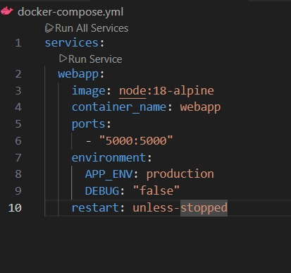

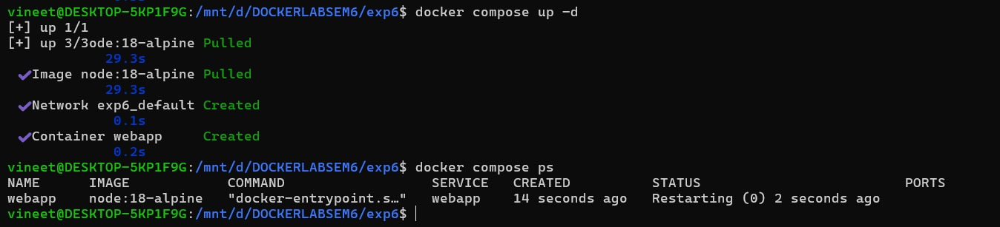

### Problem 2: Volume + Network Configuration
- Given Docker Run Commands:
```
   docker network create app-net
```
```
  docker run -d \
     --name postgres-db \
     --network app-net \
     -e POSTGRES_USER=admin \
     -e POSTGRES_PASSWORD=secret \
     -v pgdata:/var/lib/postgresql/data \
     postgres:15
```
```
  docker run -d \
     --name backend \
     --network app-net \
     -p 8000:8000 \
     -e DB_HOST=postgres-db \
     -e DB_USER=admin \
     -e DB_PASS=secret \
     python:3.11-slim
```
- Student Task:
  - Create a single ```docker-compose.yml``` file that:
    - Defines both services
    - Creates named volume ```pgdata```
    - Creates custom network ```app-net```
    - Uses ```depends_on```
1. Bring up services using one command.
2. Stop and remove everything properly.

-yml file :

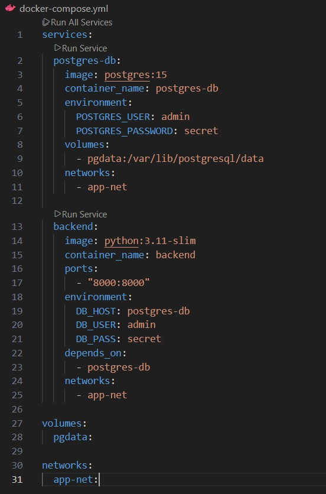

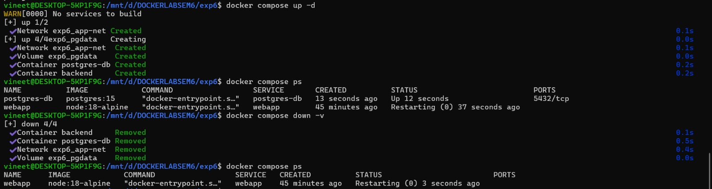


### Task 4: Resource Limits Conversion
- Given Docker Run Command:
```docker run -d \
     --name limited-app \
     -p 9000:9000 \
     --memory="256m" \
     --cpus="0.5" \
     --restart always \
     nginx:alpine
```
- Student Task:
  - Convert this to Docker Compose.
  - Add resource limits using:
      ```
     deploy:
      resources:
        limits:
      ```
      
- DOCKER COMPOSE CONVERSION :
  
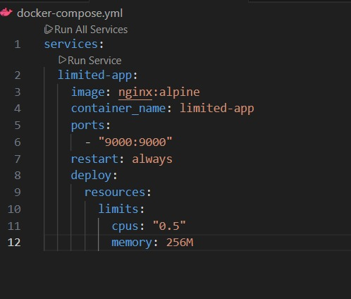

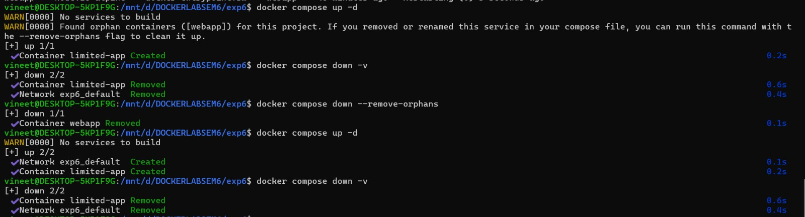

- Explain:
  - When deploy works
     - deploy: works only in Docker Swarm mode.
     - ```
       docker swarm init
       docker stack deploy -c docker-compose.yml mystack
       ```
  - Difference between normal Compose mode and Swarm mode
    - Normal Docker Compose
       - Uses docker compose up
       - Runs on single host
       - Ignores deploy section
       - Good for development
    - Docker Swarm Mode
       - Uses docker stack deploy
       - Supports clustering (multiple nodes)
       - deploy.resources.limits works
       - Used in production environments

- Dockerfile:
  
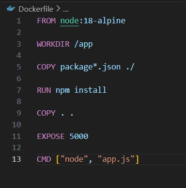

- yml file:
  
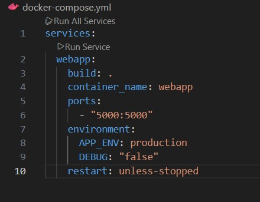

- app.js:
  
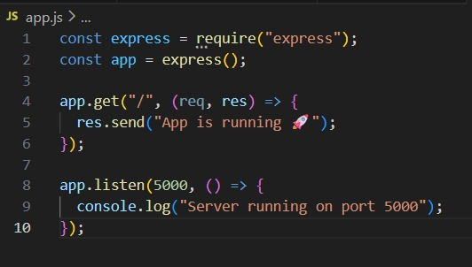

- package.json:
  
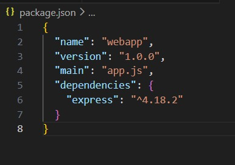

- Build and Run :
  
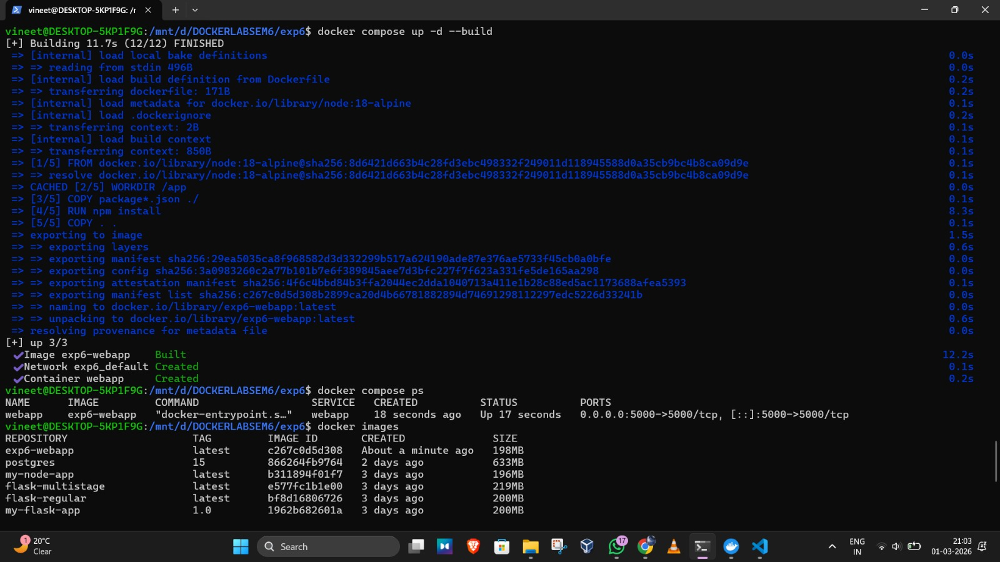


### Task 5: Replace Standard Image with Dockerfile (Node App)
#### Scenario
You are given:
```bash
docker run -d -p 3000:3000 node:18-alpine
```
- Instead of directly using `node:18-alpine`, you must:
 - Create a simple Node.js application
 - Write a custom Dockerfile
 - Use Docker Compose with the `build:` option

- Dockerfile:
  
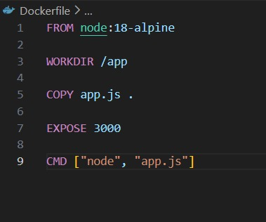

- yml file:
  
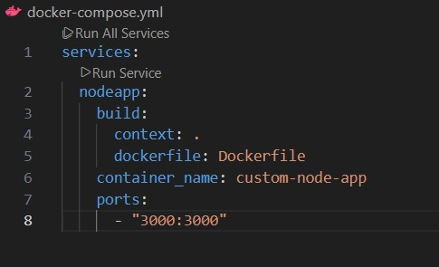

- app.js:
  
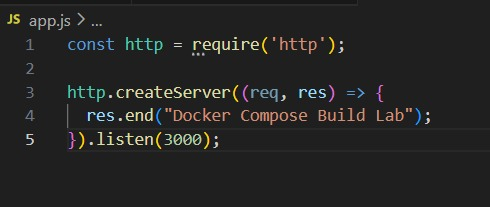

- Build and Run:
  


- CHANGE IN app.js :

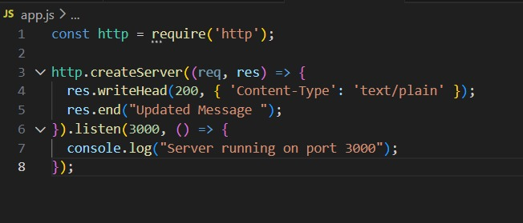

- Again Build and Run :
  
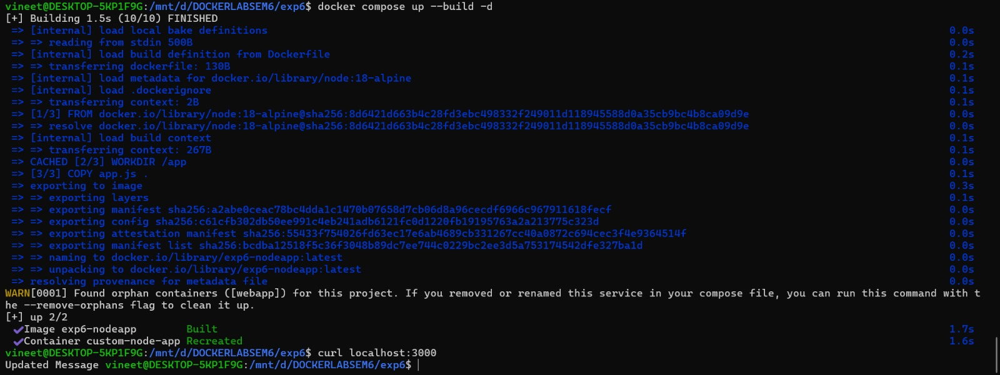

- Difference Between `image:` and `build:`

| Feature        | `image:`                          | `build:`                                  |
|---------------|-----------------------------------|--------------------------------------------|
| Source        | Pulls prebuilt image from Docker Hub | Builds image from your Dockerfile         |
| Customization | No customization                  | Full customization (app + dependencies)    |
| Startup Speed | Faster (just pulls image)         | Slightly slower (needs build process)      |
| Use Case      | Simple / testing use              | Real-world projects                        |
| Example       | `image: node:18-alpine`           | `build: .`                                 |


### Advanced Build Challenge
### Task 6: Multi-Stage Dockerfile with Compose
 - Requirement:
   - Create a simple Python FastAPI or Node production-ready app using:
      - Multi-stage Dockerfile
      - Smaller final image
      - Use Compose to build it
 - Must:
   - Write multi-stage Dockerfile
   - Use build: in Compose
   - Add environment variables
   - Add volume mount for development mode
   - Compare image size: `docker images`

- Multi-staged Dockerfile:
  
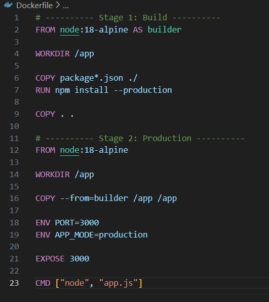

- yml file:
  
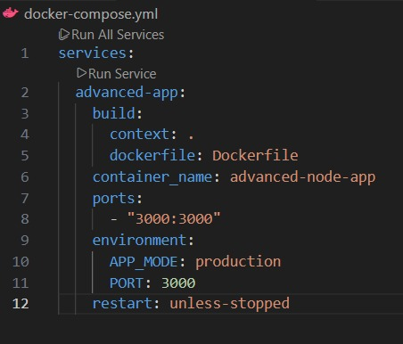

- app.js:
  
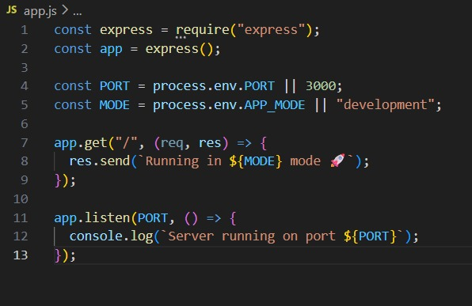

- package.json:
  
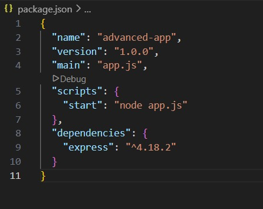

- Build and Run :
  
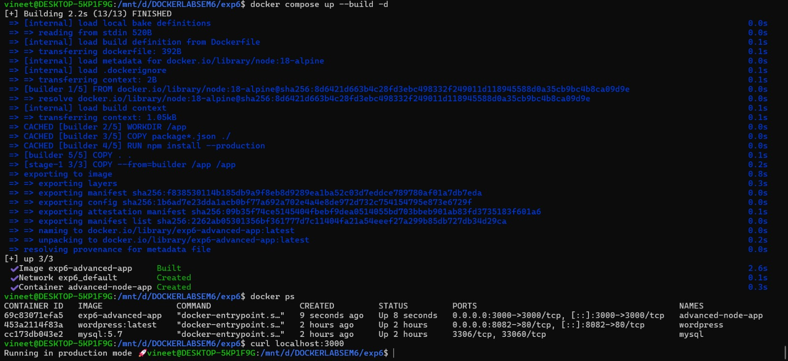
