# Lab Experiment 7: CI/CD using Jenkins, GitHub and Docker Hub
## 1. Aim
   - To design and implement a complete CI/CD pipeline using Jenkins, integrating source code from GitHub, and building & pushing Docker images to Docker Hub.

## 2. Objectives
   - Understand CI/CD workflow using Jenkins (GUI-based tool)
   - Create a structured GitHub repository with application + Jenkinsfile
   - Build Docker images from source code
   - Securely store Docker Hub credentials in Jenkins
   - Automate build & push process using webhook triggers
   - Use same host (Docker) as Jenkins agent

## 3. Theory
   - What is Jenkins?
   - Jenkins is a web-based GUI automation server used to:
   - Build applications
   - Test code
   - Deploy software

- It provides:
  - Dashboard (browser-based UI)
  - Plugin ecosystem (GitHub, Docker, etc.)
  - Pipeline as Code using Jenkinsfile

### What is CI/CD?
   - Continuous Integration (CI): Code is automatically built and tested after each commit
   - Continuous Deployment (CD): Built artifacts (Docker images) are automatically delivered/deployed

### Workflow Overview
   - Developer → GitHub → Webhook → Jenkins → Build → Docker Hub
     
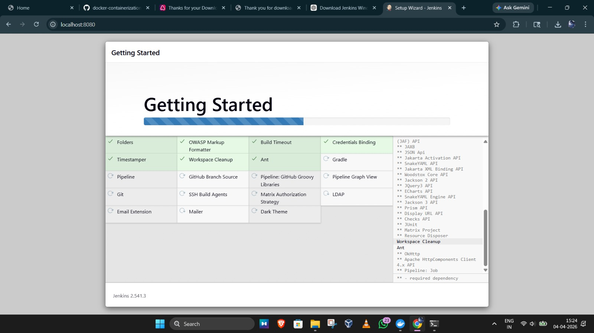

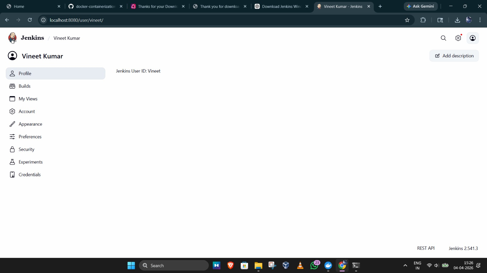

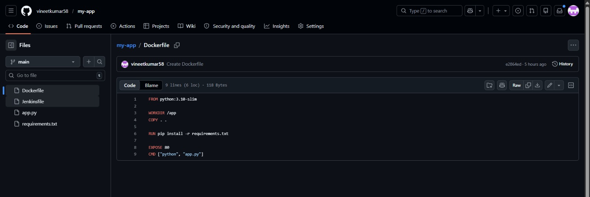

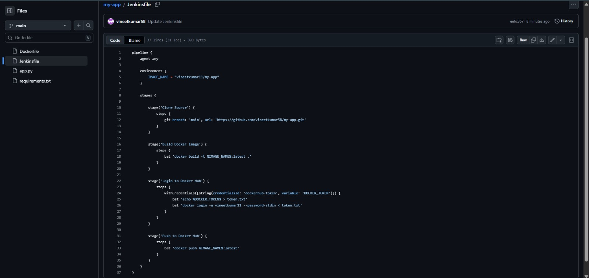

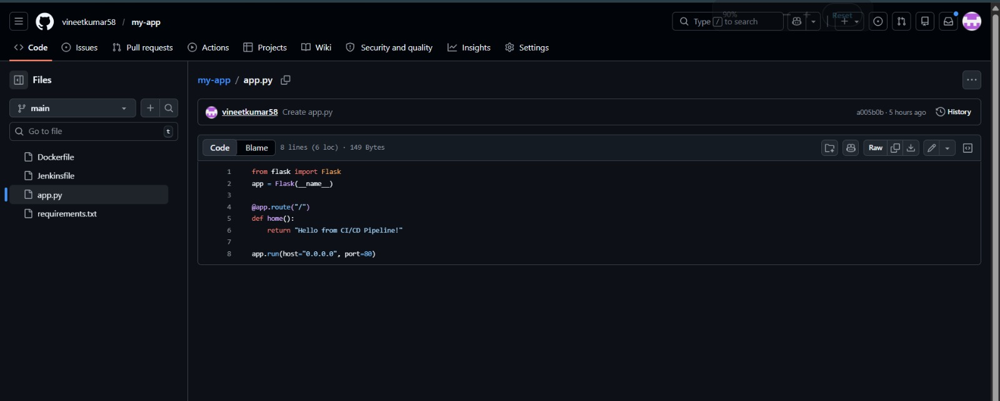

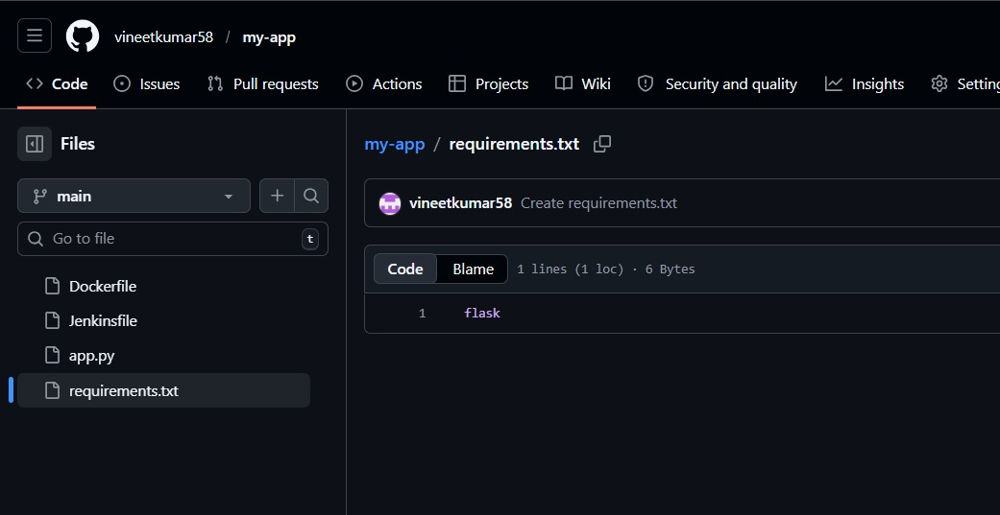

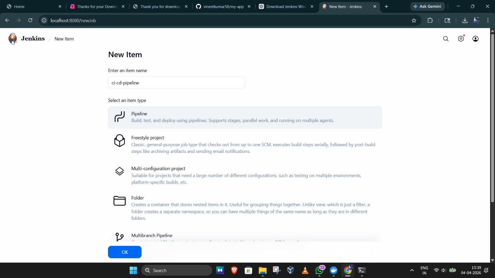

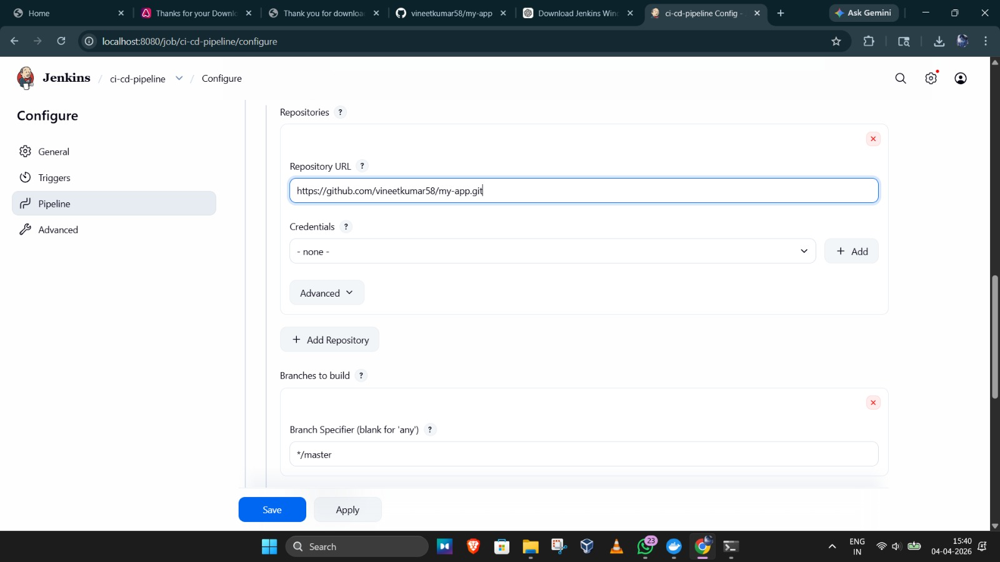

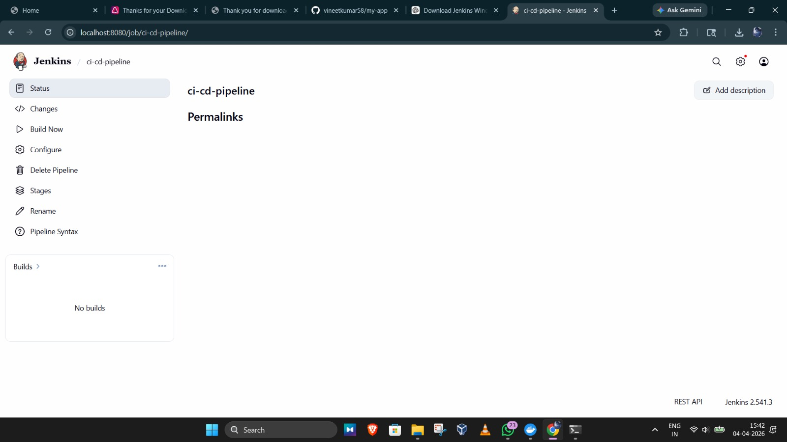

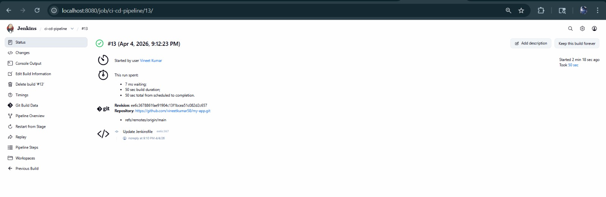

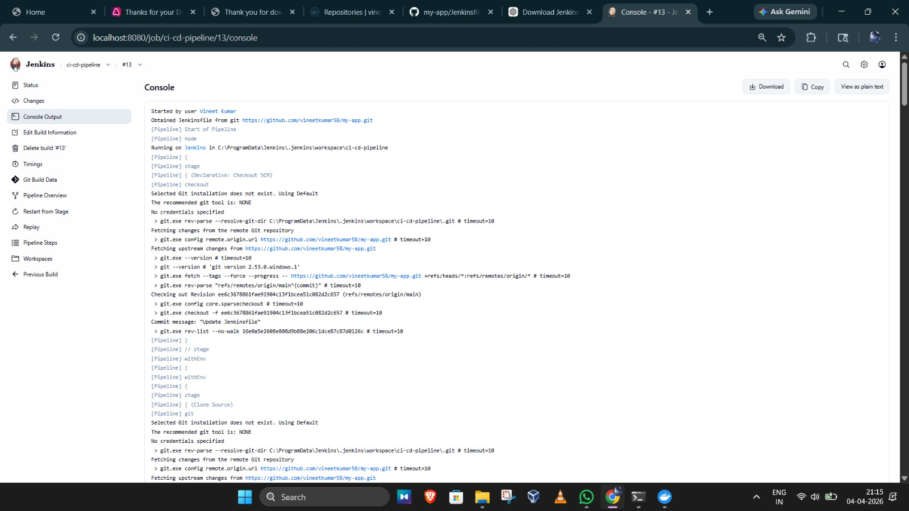

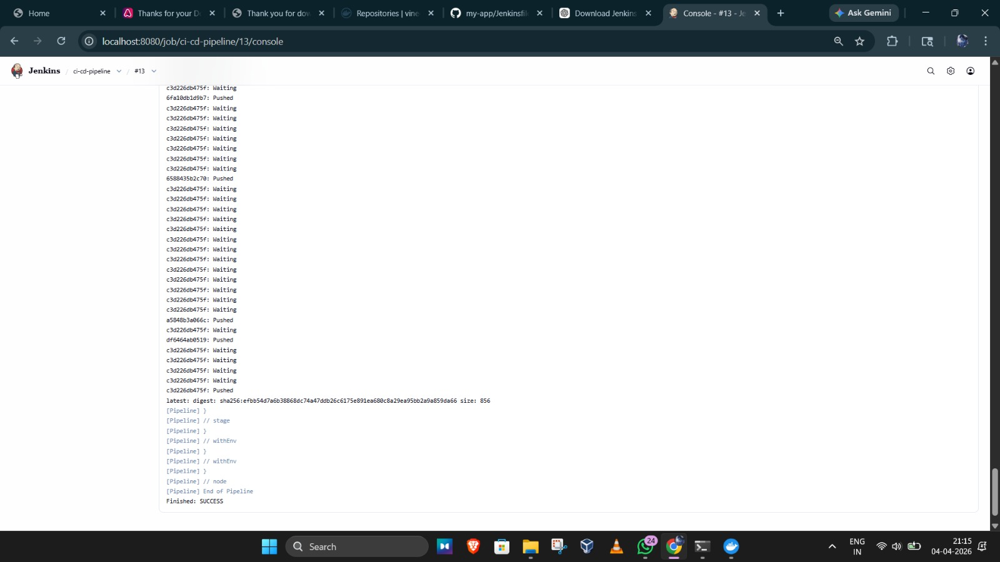

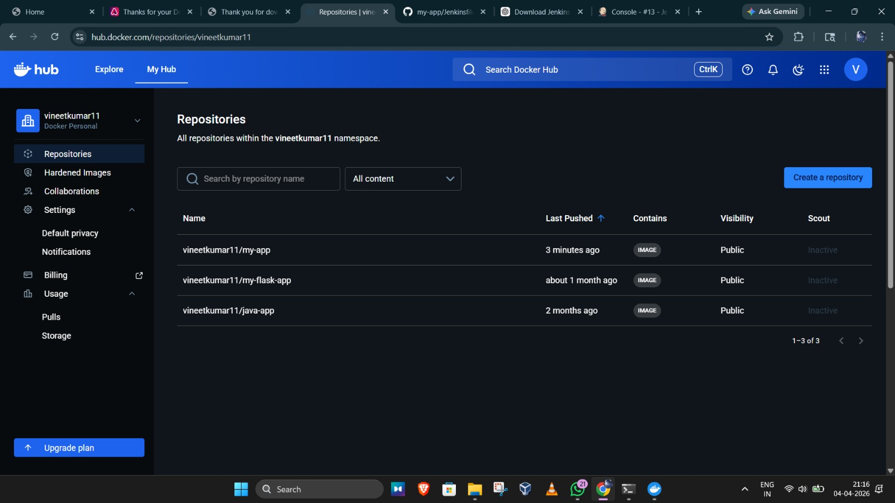

## USING DOCKER COMPOSE :

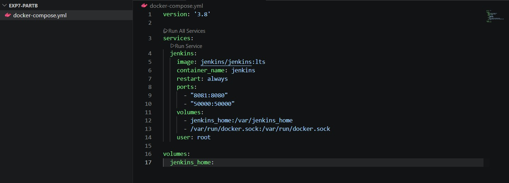

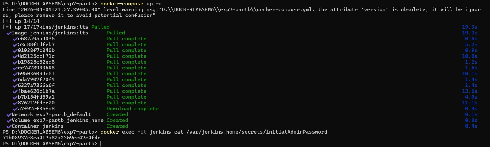

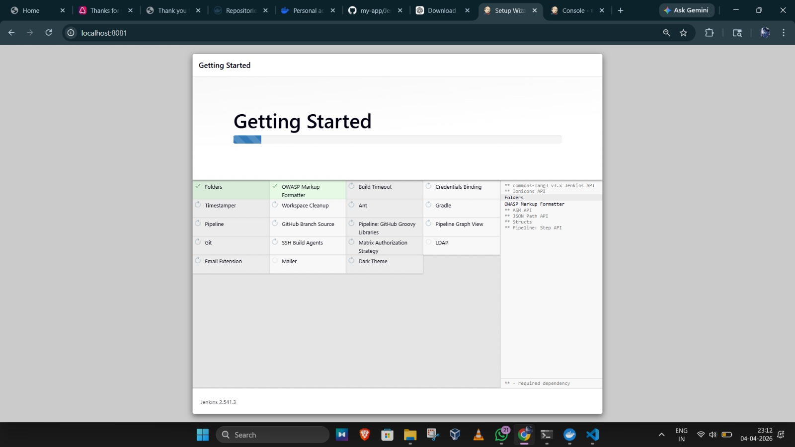
