# Experiment 9: Ansible with Docker

## Objective
To understand and implement configuration management using **Ansible** by simulating multiple servers using **Docker** containers.

---

## Theory
Ansible is an open-source automation tool used for configuration management, application deployment, and task automation. It is **agentless** and uses SSH for communication. Tasks are written in YAML-based playbooks which makes automation simple and readable.

### Key Concepts
* **Control Node:** Machine where Ansible is installed.
* **Managed Nodes:** Target systems (Docker containers).
* **Inventory:** A list or group of managed nodes.
* **Playbook:** A YAML file defining the desired state or tasks.
* **Modules:** Built-in tools like apt, copy, and service.

### Why Ansible?
* Reduces manual work
* Ensures consistency
* Saves time
* Scales easily

---

## Tools Used
* **Ansible**
* **Docker**
* **Ubuntu (WSL/Linux)**

---

## Procedure

### Step 1: Install Ansible
```bash
sudo apt update -y
sudo apt install ansible -y
ansible --version
ansible localhost -m ping
```
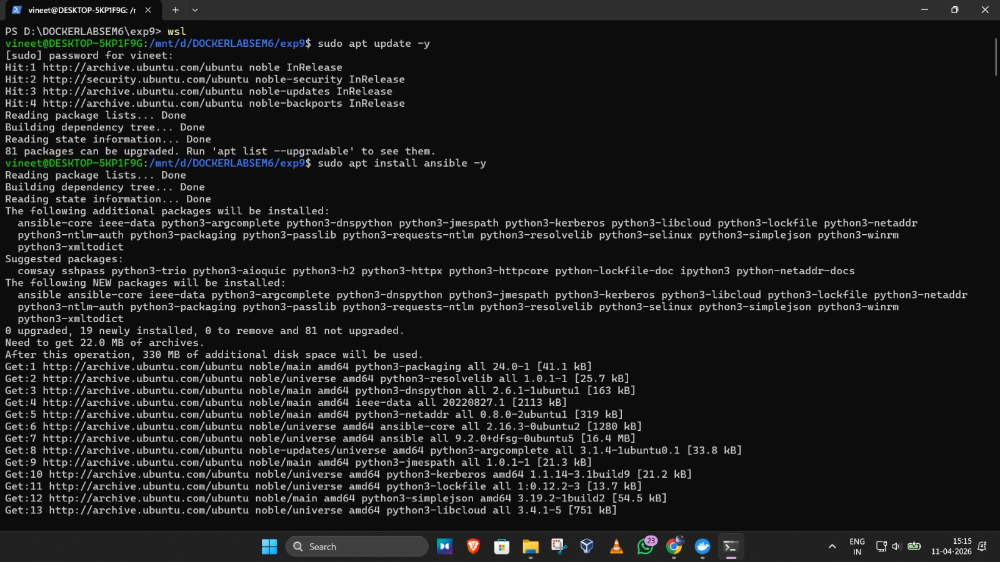

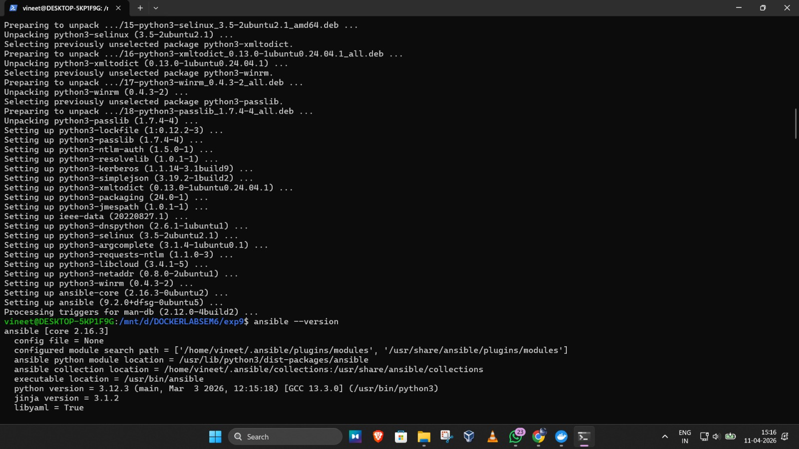

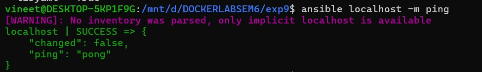

### Step 2: Generate SSH Key
```bash
ssh-keygen -t rsa -b 4096
cp ~/.ssh/id_rsa.pub .
cp ~/.ssh/id_rsa .
```
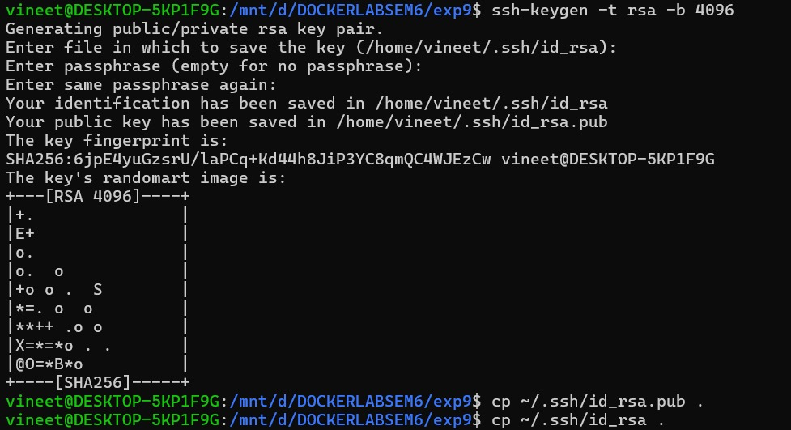

### Step 3: Create Dockerfile

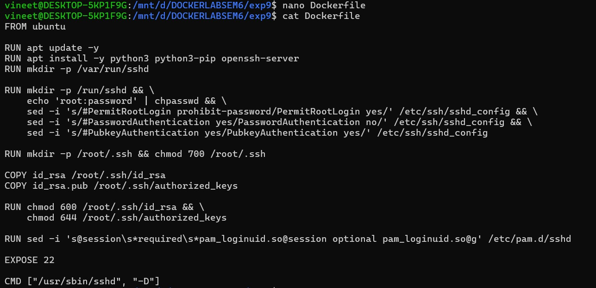

### Step 4: Build Docker Image
```bash
docker build -t ubuntu-server .
```
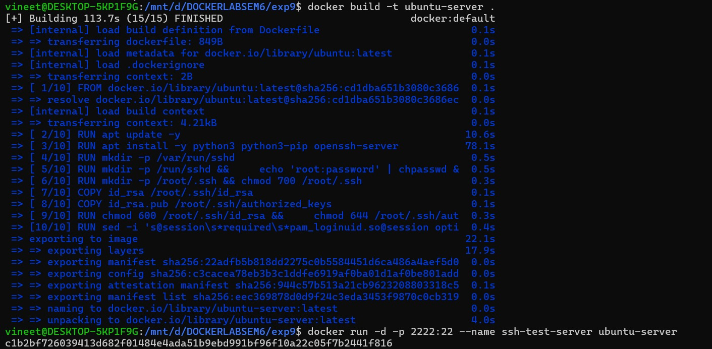

### Step 5: Test SSH
```bash
docker run -d -p 2222:22 --name ssh-test-server ubuntu-server
ssh root@localhost -p 2222
ssh -i ~/.ssh/id_rsa root@localhost -p 2222
```
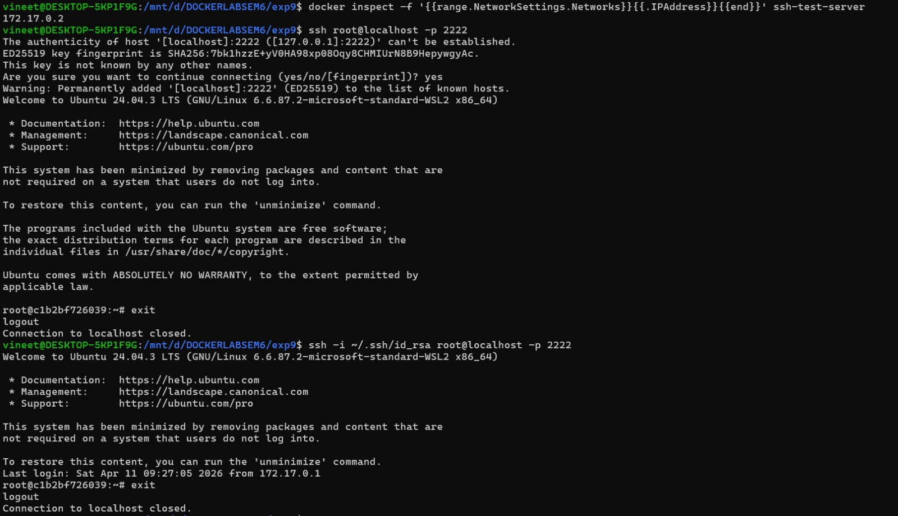

### Step 6: Remove Test Container
```bash
docker stop ssh-test-server
docker rm ssh-test-server
```
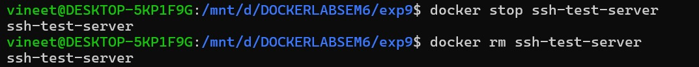

### Step 7: Run 4 Servers
```bash
for i in {1..4}; do
  docker run -d -p 220${i}:22 --name server${i} ubuntu-server
done
```
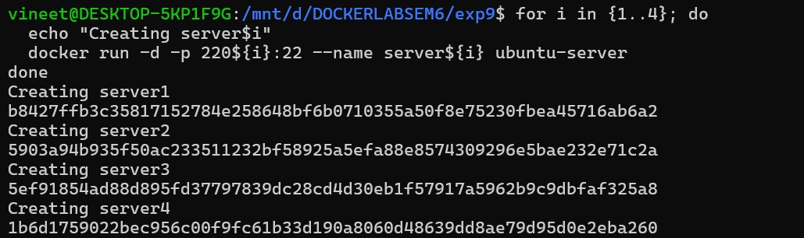

### Step 8: Create Inventory
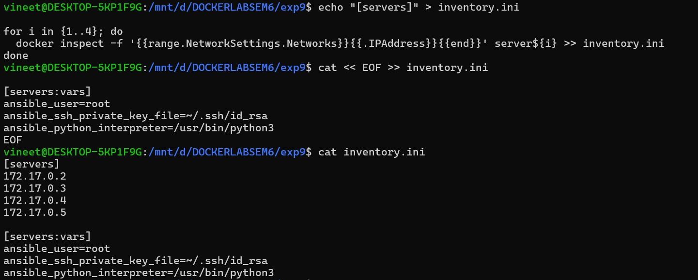

### Step 9: Test Connectivity\
```bash
ansible all -i inventory.ini -m ping
```
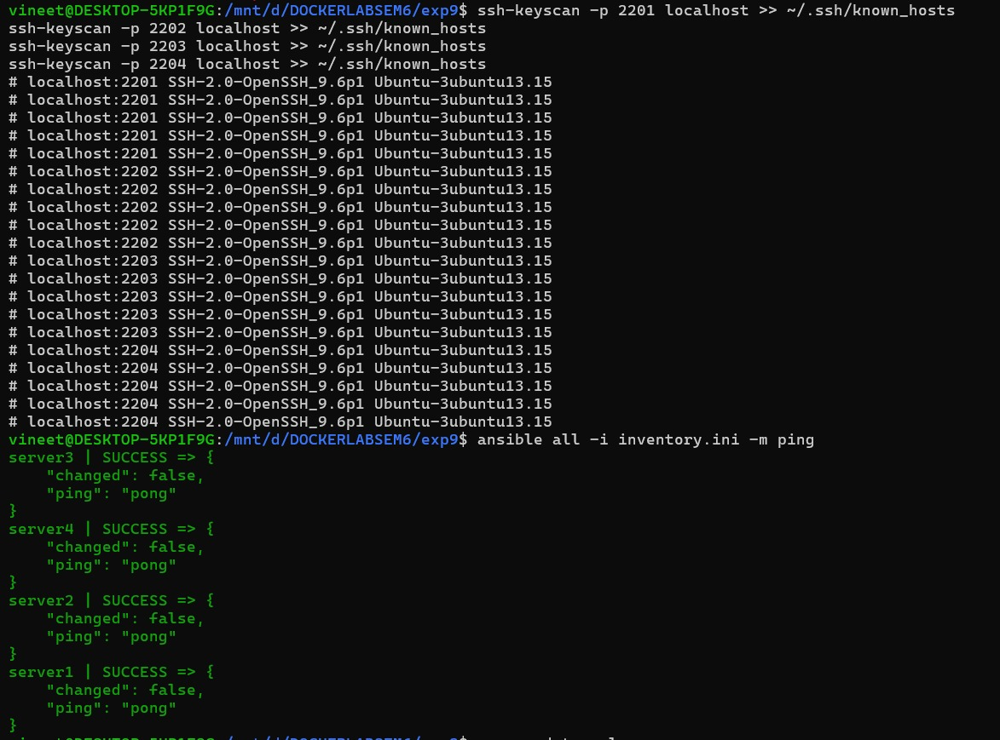

### Step 10: Create Playbook
- Create a file named update.yml:
```bash
---
- name: Update and configure servers
  hosts: all
  become: yes

  tasks:
    - name: Update apt packages
      apt:
        update_cache: yes
        upgrade: dist

    - name: Install required packages
      apt:
        name: ["vim", "htop", "wget"]
        state: present

    - name: Create test file
      copy:
        dest: /root/ansible_test.txt
        content: "Configured by Ansible on {{ inventory_hostname }}"
```
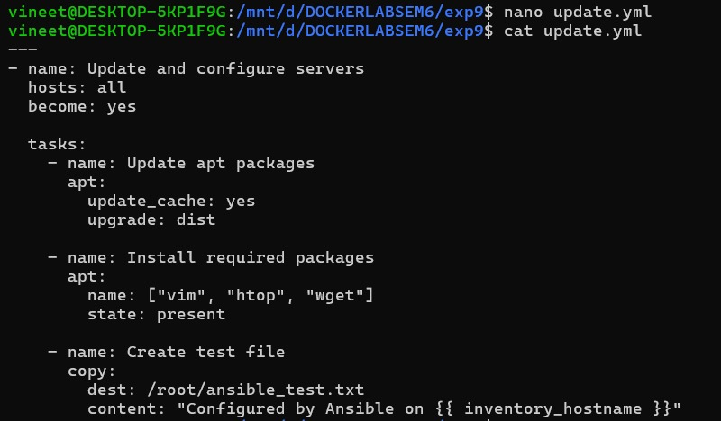

### Step 11: Run Playbook
```bash
ansible-playbook -i inventory.ini update.yml
```
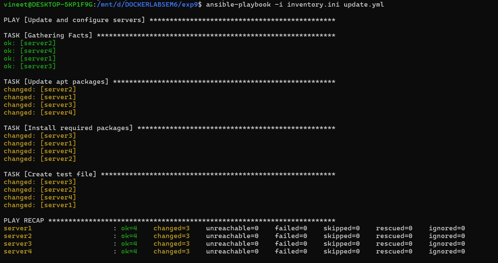

### Step 12: Verify Output
```bash
ansible all -i inventory.ini -m command -a "cat /root/ansible_test.txt"
```
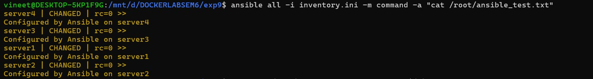

### Step 13: Cleanup
```bash
for i in {1..4}; do docker rm -f server${i}; done
```
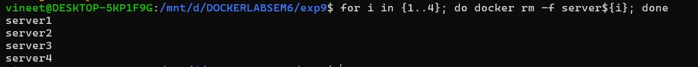

## Conclusion
### Ansible simplifies server management by automating tasks and ensuring consistency across multiple systems.

## Key Takeaways
- Ansible is agentless

- Uses SSH for communication

- Playbooks automate tasks

- Docker simulates servers
