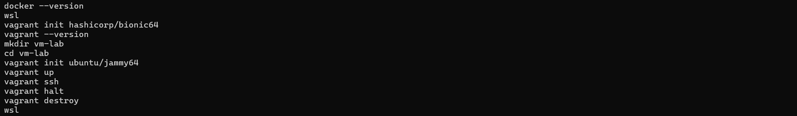
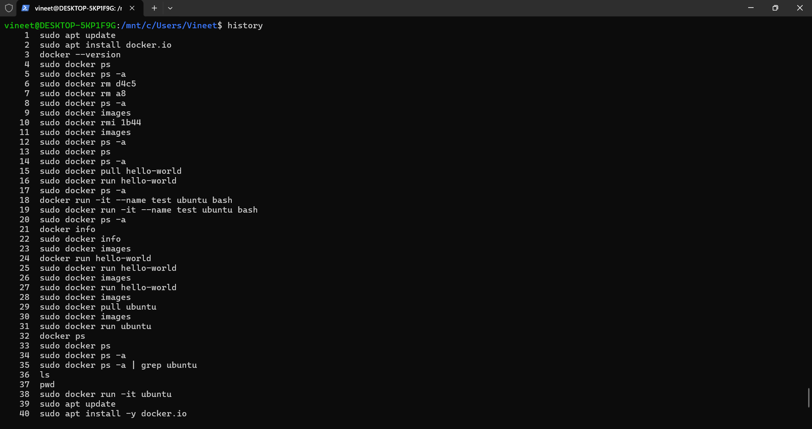
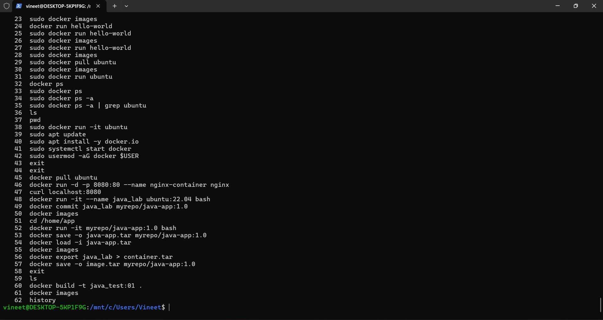
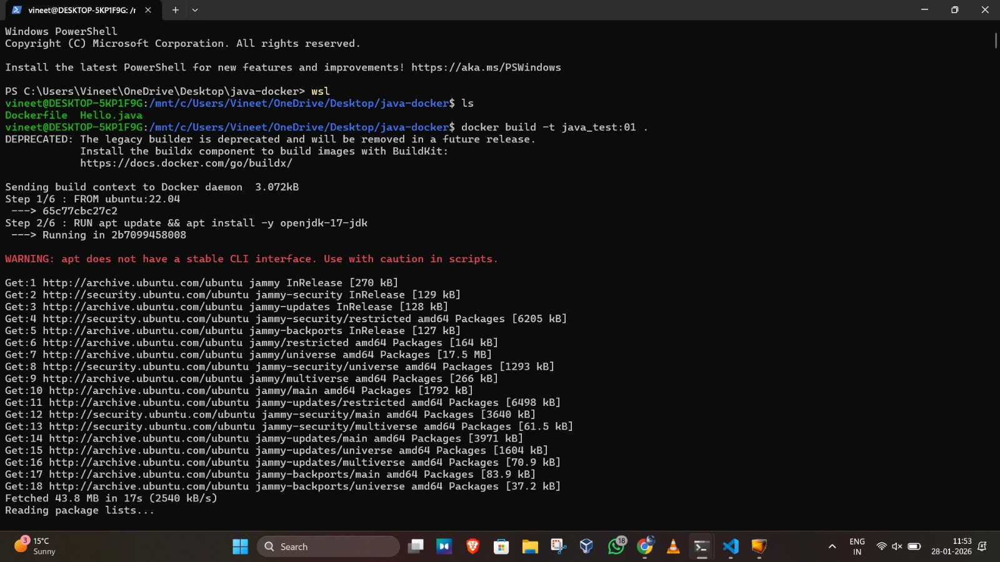
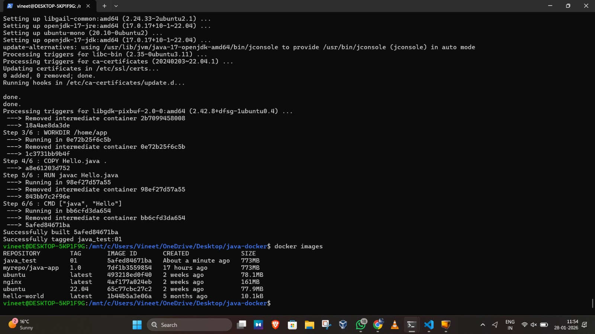
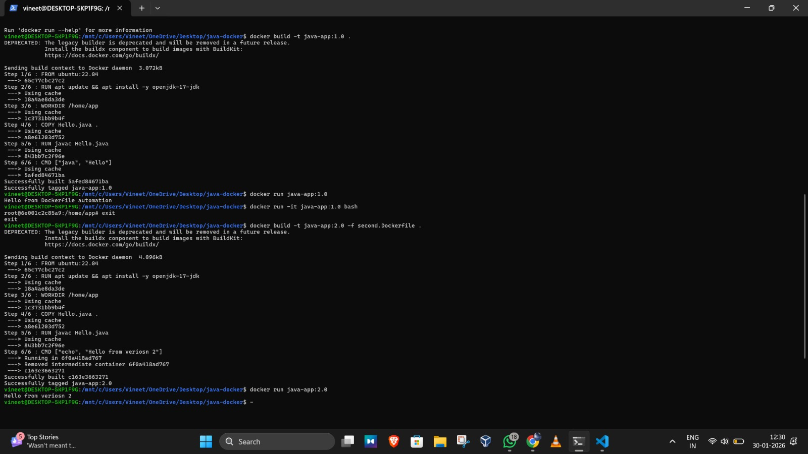
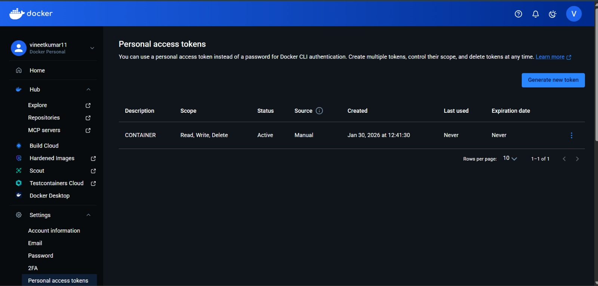
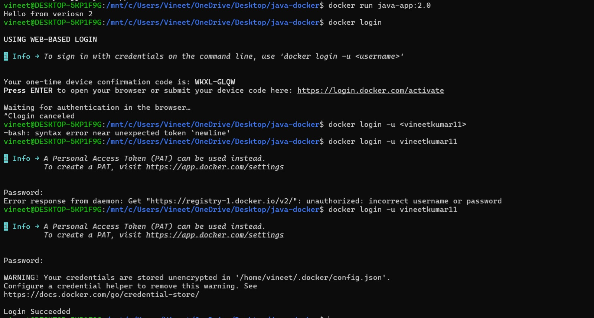
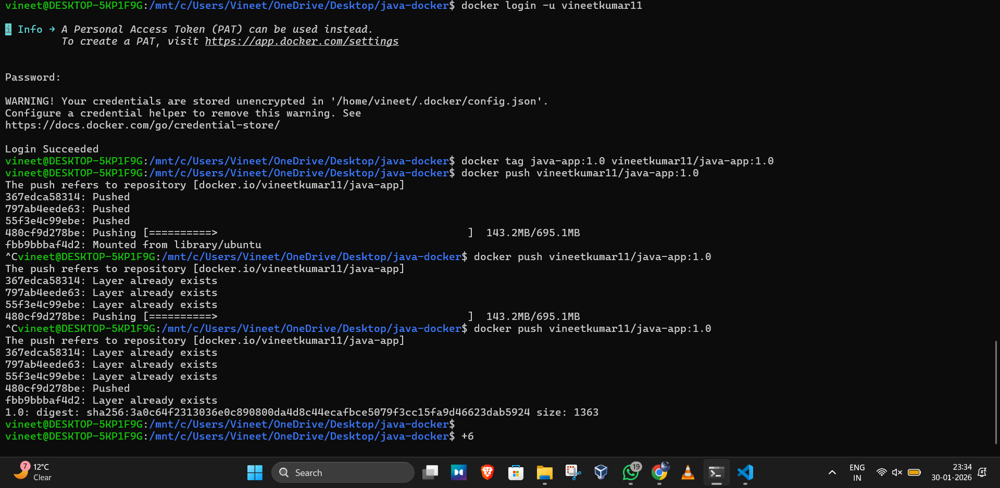
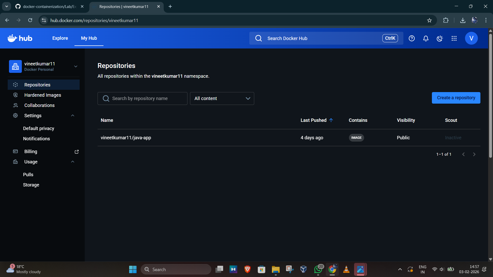

# Docker & Containerization – Theory

## commands used ( practiced in class )
These screenshots contain practice commands executed during learning Docker and containerization such as:

- Checking Docker version  
- Pulling images  
- Running containers  
- Listing containers and images  
- Building Docker images  
- Saving and loading images  

### Command History Screenshots

## 27th and 28th January
- Started an Ubuntu container using Docker and installed OpenJDK inside the container.

.png)

- Created a simple Java program (Hello.java), compiled it using javac, and executed it inside a Docker container.

.png)

- Converted a running container into a Docker image, viewed Docker images, ran a container from the created image, and saved/loaded the image as a tar file.

.png)

- created a Dockerfile for a Java application using Ubuntu as base image.
- built a Docker image from the Dockerfile.
- verified successful image creation using docker images.
- understood Docker build steps (FROM, RUN, WORKDIR, COPY, CMD).

## 29th January
- practiced Markdown syntax for documentation using online tutorial.
- created headings, subheadings, bold and italic text.
- created ordered and unordered lists.
- inserted links and images using markdown format.
- practiced writing code blocks and inline code.
- learned how to structure README files properly.

Reference:
https://www.markdowntutorial.com/

## 30th january

## 3rd February

