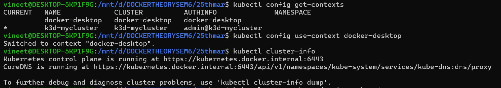

# Hands-on Task: Run and Manage a “Hello Web App” (httpd)
# Objective
# Deploy and manage a simple Apache-based web server and:
                  - verify it is running
                  - modify it
                  - scale it
                  - debug it

## Task: Deploy a Simple Web Application (Apache httpd)
   - You will run an Apache server instead of nginx.

