# Hands-on Task: Run and Manage a “Hello Web App” (httpd)
# Objective:
# Deploy and manage a simple Apache-based web server and:
   - verify it is running
   - modify it
   - scale it
   - debug it

## Task: Deploy a Simple Web Application (Apache httpd)
   - You will run an Apache server instead of nginx.

### Switch context to docker desktop

### Step 1: Run a Pod and check it
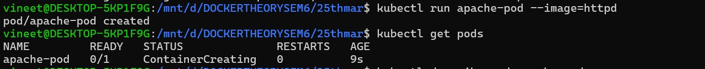

### Step 2: Inspect Pod
- Focus:
   - container image = httpd
   - ports (default 80)
   - events
     
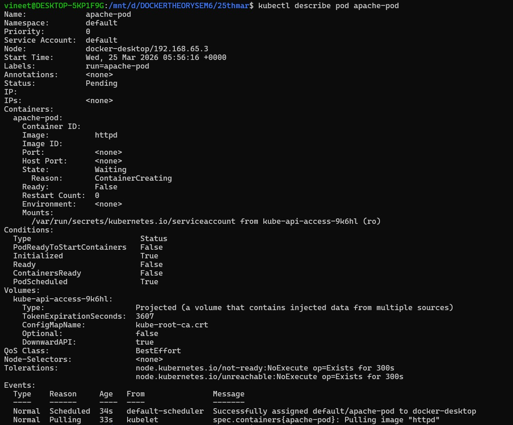

### Step 3: Access the App
- Open:
  - http://localhost:8081
- You should see: → Apache default page (“It works!”)
  
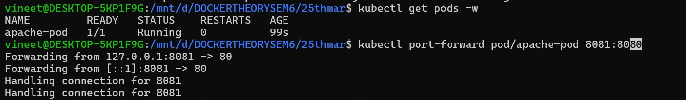

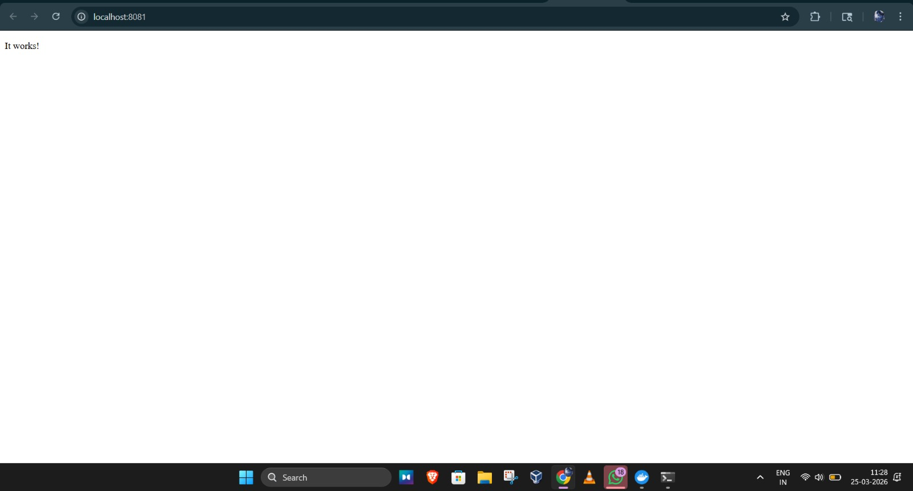

### Step 4: Delete Pod
- Insight
- Same as before:
    - Pod disappears permanently
    - No self-healing
      
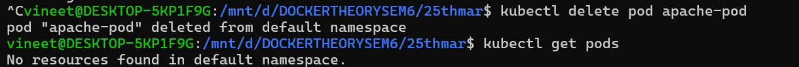

## Task: Convert to Deployment

### Step 5: Create Deployment and check it

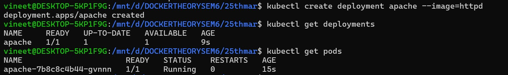

### Step 6: Expose Deployment and acess it

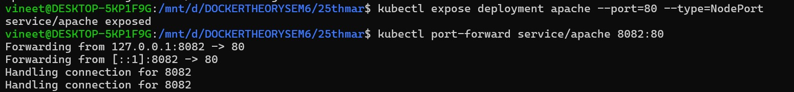

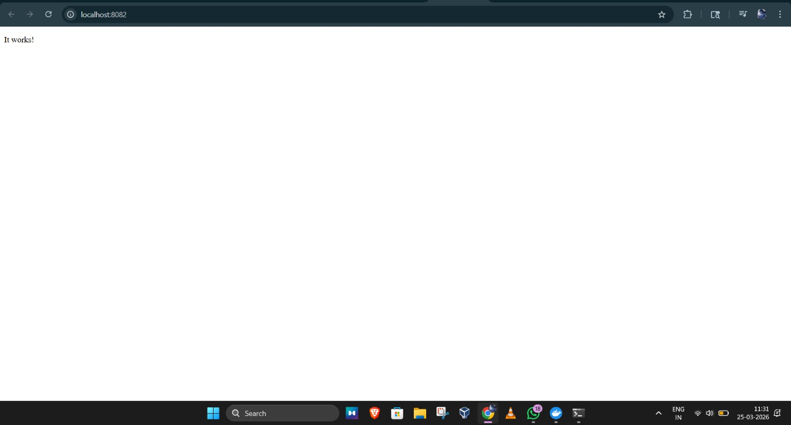

## Task: Modify Behavior

### Step 7: Scale Deployment and check it
- Observe
   - Multiple pods running same app

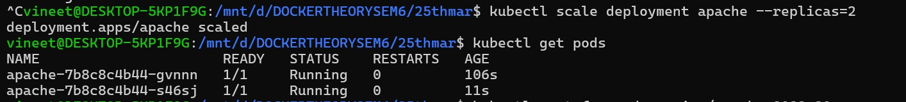

### Step 8: Test Load Distribution (Basic)
- Run port-forward again and refresh browser multiple times.
- same thing even after refreshing
  

## Task: Debugging Scenario

### Step 9: Break the App

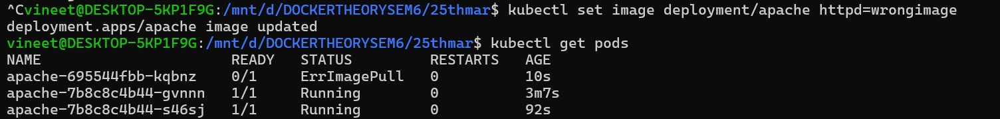

### Step 10: Diagnose
- Look for:
   - ImagePullBackOff
   - error messages

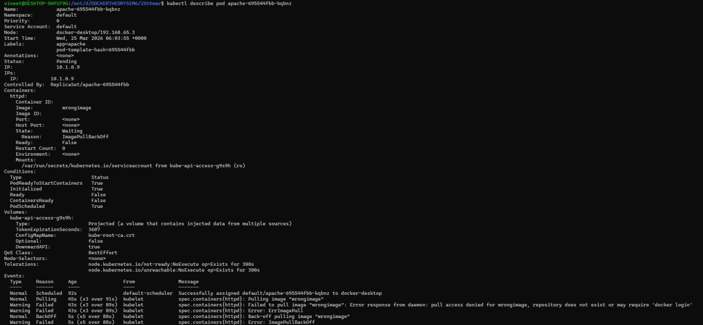

### Step 11: Fix It
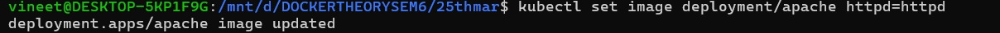

## Task: Explore Inside Container (Important Skill)

### Step 12: Exec into Pod
- Now inside container:
     - ls /usr/local/apache2/htdocs
- This is where web files are stored.
  
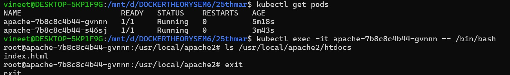

## Task: Observe Self-Healing

### Step 13: Delete One Pod
- Insight
   - Deployment recreates pod automatically
     
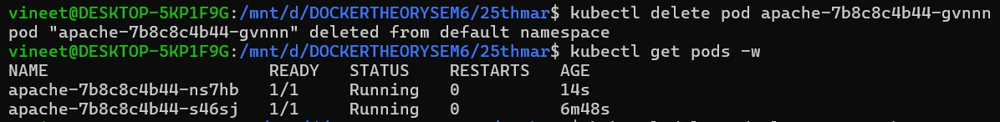

## Task: Cleanup

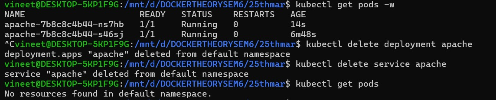

## What You Learned (Important)
- This task is better than nginx because:
    - You accessed actual web output
    - You explored container filesystem
    - You practiced debugging real errors
    - You saw scaling + recovery

## Optional Next Challenge
-Modify container at runtime:

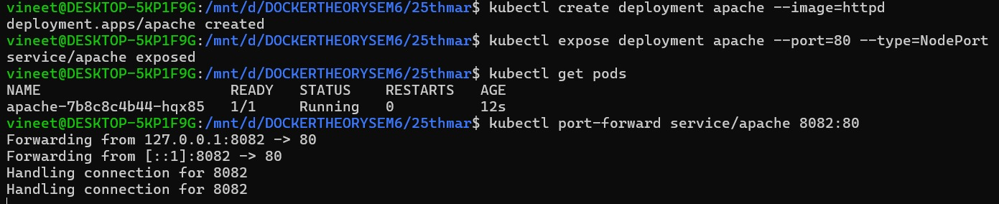

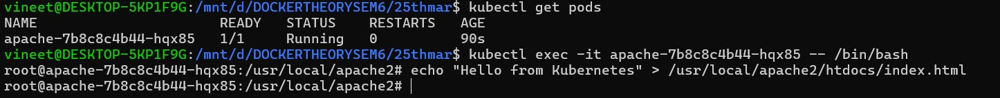

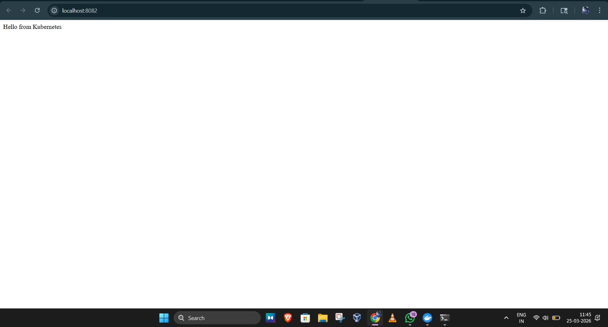
